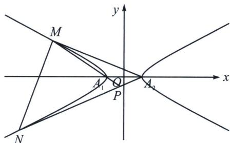

<!-- question-source:start -->
例5 (2023·新高考Ⅱ)已知双曲线 C 中心为坐标原点，左焦点为 $(-2\sqrt{5}, 0)$ ，离心率为 $\sqrt{5}$ .

(1)求 C 的方程;

## 高中数学 新思路 圆锥曲线专题

(2)记 C 的左、右顶点分别为 $A_{1}$ ， $A_{2}$ ，过点 $(-4,0)$ 的直线与 C 的左支交于 M，N 两点，M 在第二象限，直线 $MA_{1}$ 与 $NA_{2}$ 交于 P，证明 P 在定直线上.

(1)双曲线 $C$ 中心为原点，左焦点为 $(-2\sqrt{5}, 0)$ ，离心率为 $\sqrt{5}$ ，则 $\left\{ \begin{array}{l} c^2 = a^2 + b^2 \\ c = 2\sqrt{5} \\ e = \frac{c}{a} = \sqrt{5} \end{array} \right.$ ，解得 $\left\{ \begin{array}{l} a = 2 \\ b = 4 \end{array} \right.$ ，故双曲线 $C$ 的方程为 $\frac{x^2}{4} - \frac{y^2}{16} = 1$ ；

(2)发现 $MN$ 是 $x$ 轴的轴点弦, $\angle MA_{2}N$ 是 $x$ 轴的顶点角, 易判断隐藏了斜率关系 $k_{A_{2}M} \cdot k_{A_{2}N} =$ 定值. 将双曲线按照向量 $\overrightarrow{A_2O} = (-2,0)$ 平移得: $\frac{(x + 2)^2}{4} -\frac{y^2}{16} = 1$ , 此时 $M \to M'$ , $N \to N'$ ,

同时设直线 $M^{\prime}N^{\prime}$ 的方程为： $mx + ny = 1$ ，由于过定点 $(-6, 0)$ ，所以 $m = -\frac{1}{6}$ ;

与双曲线联立可得： $4x^{2}+16x(mx+ny)-y^{2}=0$ ，化简得： $-y^{2}+16nxy+4x^{2}+16mx^{2}=0$ ，

同除以 $x^{2}$ 有： $\frac{y^2}{x^2} -16n\frac{y}{x} -(4 + 16m) = 0$ ，所以 $k_{MA_2}\cdot k_{NA_2} = -(4 + 16m) = -\frac{4}{3}$

根据第三定义(考试需自证): $k_{MA_1} \cdot k_{MA_2} = \frac{b^2}{a^2} = 4$ , 所以 $k_{MA_1} = -3k_{NA_2} = -3k$ ; 又直线 $MP$ 、 $NP$ 的方程分别为: ① $l_{MP}: y = -3k(x + 2)$ , ② $l_{NP}: y = k(x - 2)$ ; 联立①②: $-3(x + 2) = x - 2$ , 整理得 $x_P = -1$ 故点 $P$ 在定直线 $x = -1$ 上.
<!-- question-source:end -->

![[高中/总复习/专题/2026版高中《mst老唐说题》圆锥曲线专题（数学）/上册/第07章_圆锥曲线常规数据处理方法/第二节_隐藏的斜率和积问题/二_隐藏的斜率之比/例题/answers/Q00048639A1.md]]
