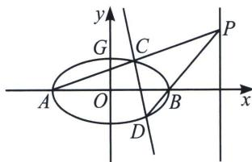

<!-- question-source:start -->
例4 (2020全国1卷)已知 $A, B$ 分别为椭圆 $E: \frac{x^2}{a^2} + y^2 = 1 (a > 1)$ 的左、右顶点, $G$ 为 $E$ 的上顶点, $\overrightarrow{AG} \cdot \overrightarrow{GB} = 8$ . $P$ 为直线 $x = 6$ 上的动点, $PA$ 与 $E$ 的另一交点为 $C$ , $PB$ 与 $E$ 的另一交点为 $D$ .

(1)求 $E$ 的方程;

(2)证明：直线 $CD$ 过定点.

<!-- question-source:end -->

![[高中/总复习/专题/2026版高中《mst老唐说题》圆锥曲线专题（数学）/上册/第07章_圆锥曲线常规数据处理方法/第二节_隐藏的斜率和积问题/二_隐藏的斜率之比/例题/answers/Q00053044A1.md]]
