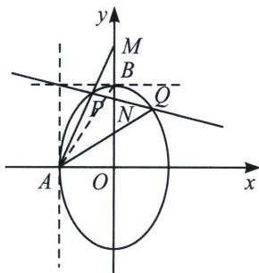

<!-- question-source:start -->
例6 (2023·乙卷)已知椭圆 $C: \frac{y^2}{a^2} + \frac{x^2}{b^2} = 1 (a > b > 0)$ 的离心率为 $\frac{\sqrt{5}}{3}$ , 点 $A(-2, 0)$ 在 $C$ 上.

(1) 求 C 的方程;

(2)过点 $(-2,3)$ 的直线交C于点P，Q两点，直线AP，AQ与y轴的交点分别为M，N，证明：线段MN的中点为定点.

(1)椭圆 $C$ 的方程为 $\frac{y^2}{9} +\frac{x^2}{4} = 1$

将椭圆按照向量 $\overrightarrow{AO}=(2,0)$ 平移得到方程： $\frac{(x-2)^{2}}{4}+\frac{y^{2}}{9}=1$ ，即 $\frac{x^{2}}{4}+\frac{y^{2}}{9}-x=0$ ，此时 $P\rightarrow P^{\prime},Q\rightarrow Q^{\prime}$ ，设 $l_{P^{\prime}Q^{\prime}}:mx+ny=1$ ，此时 $P^{\prime}Q^{\prime}$ 恒过(0,3)， $l_{P^{\prime}Q^{\prime}}:mx+\frac{y}{3}=1$ ，故将椭圆与直线联立得： $4y^{2}+9x^{2}-36x=0\Rightarrow4y^{2}+9x^{2}-36x\left(mx+\frac{y}{3}\right)=0$ ；由于 $x\neq0$ ，故同时除以 $x^{2}$ 有： $4\left(\frac{y}{x}\right)^{2}-12\left(\frac{y}{x}\right)+9-36m=0\Rightarrow k_{AP}+k_{AQ}=\frac{y_{M}}{2}+\frac{y_{N}}{2}=3$ ，所以线段MN的中点为定点(0,3).
<!-- question-source:end -->

![[高中/总复习/专题/2026版高中《mst老唐说题》圆锥曲线专题（数学）/上册/第07章_圆锥曲线常规数据处理方法/第二节_隐藏的斜率和积问题/四_平行于坐标系的中点斜率翻译/例题/answers/Q00048642A1.md]]
