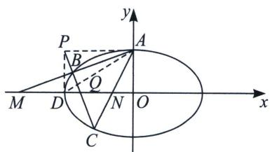

<!-- question-source:start -->
例7 (2022 北京卷)已知椭圆 $E: \frac{x^{2}}{a^{2}} + \frac{y^{2}}{b^{2}} = 1 (a > b > 0)$ 的一个顶点为 $A(0, 1)$ , 焦距为 $2\sqrt{3}$ .

(1)求椭圆 $E$ 的方程

(2) 过点 $P(-2, 1)$ 作斜率为 k 的直线与椭圆 E 交于不同的两点 B, C, 直线 AB, AC 分别与 x 轴交于点 M, N. 当 $|MN| = 2$ 时，求 k 的值.

(2) 设 $l_{AB}: y = k_1 x + 1$ ，则 $M = \left(-\frac{1}{k_1}, 0\right)$ ，同理： $N\left(-\frac{1}{k_2}, 0\right), |MN| = \left|\frac{k_1 - k_2}{k_1 k_2}\right| = \sqrt{\frac{(k_1 + k_2)^2 - 4k_1 k_2^2}{|k_1 k_2|}} = 2$ 故我们需要探索 $k_1 + k_2$ 和 $k_1 k_2$ 之间关系.

将椭圆 $E: \frac{x^2}{4} + y^2 = 1$ 按照向量 $(0, -1)$ 平移，则得到方程 $\frac{x^2}{4} + (y + 1)^2 = 1 \Rightarrow \frac{x^2}{4} + y^2 + 2y = 0$

平移后 $A \to O'$ , $B \to B'$ , $C \to C'$ , 设 $B'C'$ 方程为 $mx + ny = 1$ , 即 $\frac{x^2}{4} + y^2 + 2y = \frac{x^2}{4} + y^2 + 2y (mx + ny) = 0$ (构造齐次式), 同除以 $x^2$ 得, $(1 + 2n)\frac{y^2}{x^2} + 2m\frac{y}{x} + \frac{1}{4} = 0$ , 因为点 $B'$ , $C'$ 的坐标满足这个方程, 所以 $k_{OB'} = k_1$ , $k_{OC'} = k_2$ 是这个关于 $\frac{y}{x}$ 的方程的两个根. 所以 $k_{OX'} + k_{OB'} = k_1 + k_2 = -\frac{2m}{1 + 2n}$ , $k_1k_2 = \frac{1}{4 + 8n}$ 由于 $BC$ 过点 $P(-2, 1)$ , 所以 $B'C'$ 过定点 $P'(-2, 0)$ , 故 $m = -\frac{1}{2}$ , 则 $k_1 + k_2 = \frac{1}{1 + 2n} = 4k_1k_2$ ,
<!-- question-source:end -->

![[高中/总复习/专题/2026版高中《mst老唐说题》圆锥曲线专题（数学）/上册/第07章_圆锥曲线常规数据处理方法/第二节_隐藏的斜率和积问题/四_平行于坐标系的中点斜率翻译/例题/answers/Q00048643A1.md]]
