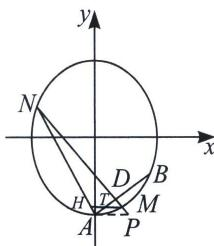

<!-- question-source:start -->
例8 (2022 全国乙卷)已知椭圆 $E$ 的中心为坐标原点, 对称轴为 $x$ 轴、 $y$ 轴, 且过 $A(0, -2)$ , $B(\frac{3}{2}, -1)$ 两点.

(1)求 E 的方程;

(2)设过点 $P(1, -2)$ 的直线交 $E$ 于 $M, N$ 两点, 过 $M$ 且平行于 $x$ 轴的直线与线段 $AB$ 交于点 $T$ , 点 $H$ 满足 $\overrightarrow{MT} = \overrightarrow{TH}$ . 证明: 直线 $HN$ 过定点.

(1) 设 $E: \frac{x^2}{a^2} + \frac{y^2}{b^2} = 1$ ，将 $(0, -2)$ ， $\left(\frac{3}{2}, -1\right)$ 代入得 $\begin{cases} a^2 = 3 \\ b^2 = 4 \end{cases}$ ，所以 $\frac{x^2}{3} + \frac{y^2}{4} = 1$ .

(2)将椭圆 $E: \frac{x^2}{3} + \frac{y^2}{4} = 1$ 按照向量 $\overrightarrow{AO}$ : (0, 2)平移, 则得到方程 $\frac{x^2}{3} + \frac{(y - 2)^2}{4} = 1 \Rightarrow \frac{x^2}{3} + \frac{y^2}{4} - y = 0$ , 平移后 $P \to P'$ , $A \to O$ , $B \to B'$ , $M \to M'$ , $N \to N'$ , $H \to H'$ 易知 $M'N'$ 过点 $P'(1, 0)$ . 设 $M'N'$ 方程为 $mx + ny = 1$ , 由于点 $P'(1, 0)$ 在 $M'N'$ 上, 所以 $m = 1$ . 即 $\frac{x^2}{3} + \frac{y^2}{4} - y = \frac{x^2}{3} + \frac{y^2}{4} - y (x + ny) = 0$ (构造齐次式), 同除以 $x^2$ 得, $\left(-n + \frac{1}{4}\right) \frac{y^2}{x^2} - \frac{y}{x} + \frac{1}{3} = 0$ , 所以 $k_1, k_2$ 是这个关于 $\frac{y}{x}$ 的方程的两个根, 所以 $\frac{1}{k_1} + \frac{1}{k_2} = \frac{k_1 + k_2}{k_1 k_2} = 3$ .

点 $H$ 满足 $\overrightarrow{MT} = \overrightarrow{TH}$ ，则一定有 $\frac{1}{k_{AH}} + \frac{1}{k_{AM}} = \frac{2}{k_{AT}} = 3$ ，所以 $k_{AH} = k_{AN}$ ，故 $A, H, N$ 三点共线直线 $HN$ 恒过 $(0, -2)$ .
<!-- question-source:end -->

![[高中/总复习/专题/2026版高中《mst老唐说题》圆锥曲线专题（数学）/上册/第07章_圆锥曲线常规数据处理方法/第二节_隐藏的斜率和积问题/四_平行于坐标系的中点斜率翻译/例题/answers/Q00048644A1.md]]
