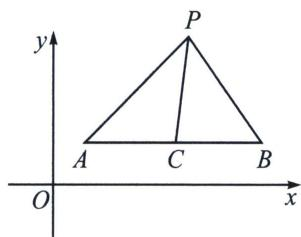
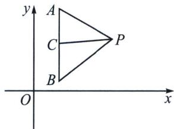

## 四、平行于坐标系的中点斜率翻译

如图，PC 为 $\triangle PAB$ 的中线，设直线 AP，BP，CP 的斜率分别为 $k_{1}$ ， $k_{2}$ ， $k_{3}$ ，

①若 $AB$ 与 $x$ 轴平行，则： $\frac{1}{k_1} +\frac{1}{k_2} = \frac{2}{k_3}$ ；②若 $AB$ 与 $y$ 轴平行，则： $k_{1} + k_{2} = 2k_{3}$

![[高中/总复习/专题/2026版高中《mst老唐说题》圆锥曲线专题（数学）/上册/第07章_圆锥曲线常规数据处理方法/第二节_隐藏的斜率和积问题/四_平行于坐标系的中点斜率翻译/例题/Q00048642.md]]
![[高中/总复习/专题/2026版高中《mst老唐说题》圆锥曲线专题（数学）/上册/第07章_圆锥曲线常规数据处理方法/第二节_隐藏的斜率和积问题/四_平行于坐标系的中点斜率翻译/例题/Q00048643.md]]
![[高中/总复习/专题/2026版高中《mst老唐说题》圆锥曲线专题（数学）/上册/第07章_圆锥曲线常规数据处理方法/第二节_隐藏的斜率和积问题/四_平行于坐标系的中点斜率翻译/例题/Q00048644.md]]
