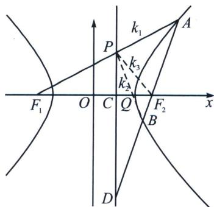

<!-- question-source:start -->
例9 (24 武汉二调)已知双曲线 $E: \frac{x^{2}}{a^{2}} - \frac{y^{2}}{b^{2}} = 1$ 的左右焦点为 $F_{1}, F_{2}$ , 其右准线为 $l$ , 点 $F_{2}$ 到直线 $l$ 的距离为 $\frac{3}{2}$ , 过点 $F_{2}$ 的动直线交双曲线 $E$ 于 $A, B$ 两点, 当直线 $AB$ 与 $x$ 轴垂直时, $|AB| = 6$ .

(1)求双曲线 E 的标准方程;

(2)设直线 $AF_{1}$ 与直线 l 的交点为 P，证明：直线 PB 过定点.

(2) $A(x_{1},y_{1}),B(x_{2},y_{2}),F_{2}(2,0)$ ，设 $\overrightarrow{AF_2} = \lambda \overrightarrow{F_2B}$ ，exists点 $D$ ，使得 $\overrightarrow{AD} = -\lambda \overrightarrow{DB}$ ，所以 $\left\{ \begin{array}{l}\frac{x_1 + \lambda x_2}{1 + \lambda} = x_{F_2} = 2\\ \frac{y_1 + \lambda y_2}{1 + \lambda} = y_{F_2} = 0 \end{array} \right.$ ，故 $\left\{ \begin{array}{l}\frac{x_1 - \lambda x_2}{1 - \lambda} = x_D\\ \frac{y_1 - \lambda y_2}{1 - \lambda} = y_D \end{array} \right.$ ，两式相减得： $\frac{(x_1 + \lambda x_2)(x_1 - \lambda x_2)}{(1 + \lambda)(1 - \lambda)}$

$\frac{(y_{1}+\lambda y_{2})(y_{1}-\lambda y_{2})}{3(1+\lambda)(1-\lambda)}=1$ ，即 $x_{D}=\frac{1}{2}$

所以 $\left\{ \begin{array}{l}x_{1} + \lambda x_{2} = 2(1 + \lambda)\\ x_{1} - \lambda x_{2} = \frac{1}{2} (1 - \lambda),\\ y_{1} + \lambda y_{2} = 0 \end{array} \right.$ 即 $\left\{ \begin{array}{l}x_1 = \frac{5}{4} +\frac{3}{4}\lambda \\ x_2 = \frac{5}{4} +\frac{3}{4\lambda},A(x_1,y_1),P\left(\frac{1}{2},y_P\right),F_1(-2,0)\text{三点共线，则}\frac{y_P}{\frac{1}{2} + 2}\\ y_1 + \lambda y_2 = 0 \end{array} \right.$

$= \frac{y_1}{x_1 + 2}$ , 所以 $y_{P} = \frac{10y_{1}}{13 + 3\lambda}$ ①, 根据 $AB$ 上下对称性 (AB 可轮换上下对称) 可知, $PB$ 过的定点在 $x$ 轴上, 设为点 $Q(t,0)$ ,

$B(x_{2},y_{2})$ 、 $P\left(\frac{1}{2},y_P\right)$ 、 $Q(t,0)$ 三点共线，则 $\frac{y_P}{\frac{1}{2} - t} = \frac{y_2}{x_2 - t}\Rightarrow \frac{10y_1}{(13 + 3\lambda)\left(\frac{1}{2} -t\right)} = \frac{y_1}{-\lambda\left(\frac{5}{4} + \frac{3}{4\lambda} -t\right)},t$ $= \frac{14}{13}$ ，故直线 $PB$ 过定点过 $Q:\left(\frac{14}{13},0\right).$

注意：本题还隐藏另一个结论，就是 $k_{PA}=k_{1}$ ， $k_{PB}=k_{2}$ ， $k_{PF}=k_{3}$ ，利用定比点差能证明 $k_{1}+k_{2}=2k_{3}$ .
<!-- question-source:end -->
