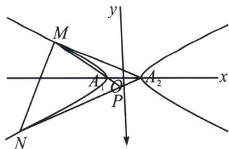

<!-- question-source:start -->
例10 (2023·新高考Ⅱ)已知双曲线 C 中心为坐标原点，左焦点为 $(-2\sqrt{5}, 0)$ ，离心率为 $\sqrt{5}$ .

(1) 求 C 的方程;

(2)记 C 的左、右顶点分别为 $A_{1}$ ， $A_{2}$ ，过点 $(-4,0)$ 的直线与 C 的左支交于 M，N 两点，M 在第二象限，直线 $MA_{1}$ 与 $NA_{2}$ 交于 P，证明 P 在定直线上.

(1)双曲线 $C$ 中心为原点，左焦点为 $(-2\sqrt{5}, 0)$ ，离心率为 $\sqrt{5}$ ，则 $\left\{ \begin{array}{l} c^2 = a^2 + b^2 \\ c = 2\sqrt{5} \\ e = \frac{c}{a} = \sqrt{5} \end{array} \right.$ ，解得 $\left\{ \begin{array}{l} a = 2 \\ b = 4 \end{array} \right.$ ，

故双曲线 C 的方程为 $\frac{x^{2}}{4}-\frac{y^{2}}{16}=1$ ;

(2)(定比点差): 过点 $(-4, 0)$ 的直线与 $C$ 的左支交于 $M, N$ 两点, 设 $M(x_1, y_1), N(x_2, y_2)$ ,

满足 $\overrightarrow{MF} = \lambda \overrightarrow{FN}$ ；即有 $-4 = \frac{x_1 + \lambda x_2}{1 + \lambda}, 0 = \frac{y_1 + \lambda y_2}{1 + \lambda}$ ；又 $M(x_1, y_1)$ ， $N(x_2, y_2)$ 在双曲线上，则满足 $\left\{ \begin{array}{l} \frac{x_1^2}{4} - \frac{y_1^2}{16} = 1 \\ \frac{(\lambda x_2)^2}{4} - \frac{(\lambda y_2)^2}{16} = \lambda^2 \end{array} \right.$ ，两式相减得： $\frac{(x_1 - \lambda x_2)(x_1 + \lambda x_2)}{4(1 - \lambda)(1 + \lambda)} - \frac{(y_1 - \lambda y_2)(y_1 + \lambda y_2)}{16(1 - \lambda)(1 + \lambda)} = 1$ ，

即 $\left\{ \begin{array}{l}x_{1} - \lambda x_{2} = -1(1 - \lambda)\\ x_{1} + \lambda x_{2} = -4(1 + \lambda) \end{array} \right.\Rightarrow \left\{ \begin{array}{l}x_{1} = \frac{-5 - 3\lambda}{2}\\ x_{2} = \frac{-5\lambda - 3}{2\lambda},M,P,A_{1}\text{三点共线：}\frac{y_{P}}{x_{P} + 2} = \frac{y_{1}}{x_{1} + 2}\text{①，}N,P,A_{2}\text{三点共}\\ y_{1} + \lambda y_{2} = 0 \end{array} \right.$

线： $\frac{y_P}{x_P - 2} = \frac{y_2}{x_2 - 2}$ ②；故 $\frac{x_P + 2}{x_P - 2} = \frac{y_2(x_1 - 2)}{y_1(x_2 + 2)} = \frac{-\lambda y_2\left(\frac{-3 - 5\lambda}{2\lambda} - 2\right)}{y_2\left(\frac{-3\lambda - 5}{2} + 2\right)} = -3$ ，所以 $x_{P} = -1$ ，点 $P$ 在定直线 $x = -1$ 上.
<!-- question-source:end -->

![[高中/总复习/专题/2026版高中《mst老唐说题》圆锥曲线专题（数学）/上册/第07章_圆锥曲线常规数据处理方法/第四节_定比点差法/三_定比点差法与轴点弦的三炮齐鸣/例题/answers/Q00048668A1.md]]
