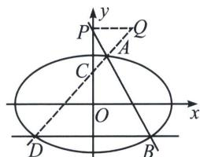

<!-- question-source:start -->
例6 (2024·北京卷)已知椭圆方程 $E: \frac{x^{2}}{a^{2}} + \frac{y^{2}}{b^{2}} = 1 (a > b > 0)$ , 以椭圆 $E$ 的焦点和短轴端点为顶点的四边形是边长为 2 的正方形. 过点 $(0, t)(t > \sqrt{2})$ 且斜率存在的直线与椭圆 $E$ 交于不同的两点 $A, B$ , 过点 $A$ 和 $C(0, 1)$ 的直线 $AC$ 与椭圆 $E$ 的另一个交点为 $D$ .

(1)求椭圆 E 的方程及离心率;

(2)若直线 BD 的斜率为 0，求 t 的值.

<!-- question-source:end -->

![[高中/总复习/专题/2026版高中《mst老唐说题》圆锥曲线专题（数学）/上册/第07章_圆锥曲线常规数据处理方法/第四节_定比点差法/三_定比点差法与轴点弦的三炮齐鸣/例题/answers/Q00053060A1.md]]
