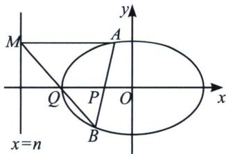

> [!faq]- 《圆锥曲线专题(上册)》例题解析
>
> > [!success]- **【答案】** 详见解析
>
> > [!note]- **【分析】**
> > 本题未单列分析。
>
> > [!note]- **【解析】**
> > 解析 因为 $\frac{x^2}{4} + y^2 = m$ ，所以 $\frac{x^2}{4m} + \frac{y^2}{m} = 1$ ，因为 $P(0,1)$ ， $\overrightarrow{AP} = 2\overrightarrow{PB}$ 故存在点 $Q$ ，使得 $\overrightarrow{AQ} = -2\overrightarrow{QB}$ ，根据定比点差得： $\frac{x_P x_Q}{4m} + \frac{y_P y_Q}{m} = 1$ ，故 $y_Q = m$ ，因此可得： $\left\{ \begin{array}{l} y_A = \frac{1 + m}{2} + \frac{1 - m}{2} \times 2 \\ y_B = \frac{1 + m}{2} + \frac{1 - m}{2 \times 2} \end{array} \right.$ ，又因为点 $B$ 在椭圆上，所以 $x_B^2 = 4m - 4y_B^2 = 4m - 4\left(\frac{1 + m}{2} + \frac{1 - m}{4}\right)^2 = -\frac{m^2}{4} + \frac{5}{2}m - \frac{9}{4}$ ，故当 $m = 5$ 时， $x_B^2$ 取最大值 4，此时 $|x_B| = 2$ .
> > ## 1. 三炮齐鸣破解中点截距定理
> > 如图所示, 在椭圆 $\frac{x^{2}}{a^{2}} + \frac{y^{2}}{b^{2}} = 1 (a > b > 0)$ 中, $A 、 B$ 为椭圆上的两点, 设 $x$ 轴上一点 $P(m, 0)$ , 存在直线 $x = n$ 和 $x$ 轴上一点 $Q$ , 连接 $BQ$ 并延长交直线 $x = n$ 于 $M$ , 则: ① $n = \frac{a^{2}}{m}$ ;
> > - **②**：直线 $AM \parallel x$ 轴: ③ $x_{Q} = \frac{m + \frac{a^{2}}{m}}{2}$ .
> > 
