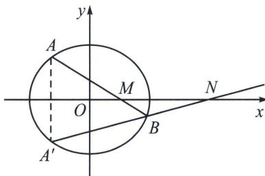

> [!faq]- 《圆锥曲线专题(上册)》例题解析
>
> > [!success]- **【答案】** 详见解析
>
> > [!note]- **【解析】**
> > 解析 (1)由离心率 $e = \frac{c}{a} = \sqrt{1 - \frac{b^2}{a^2}} = \frac{\sqrt{2}}{2}$ ，可得 $a^2 = 2b^2$ ，所以椭圆的方程为： $\frac{x^2}{2b^2} + \frac{y^2}{b^2} = 1$ ，将 $(-1, \frac{\sqrt{2}}{2})$ 代入椭圆的方程可得： $\frac{1}{2b^2} + \frac{2}{4b^2} = 1$ ，解得 $b^2 = 1$ ，所以椭圆的方程为： $\frac{x^2}{2} + y^2 = 1$ ；
> >
> > (2)证明：由椭圆的对称性可得直线 $AQ$ ， $BP$ 的交点在 $x$ 轴上，由(1)可得右焦点 $F(1,0)$ ，
> >
> > 令 $\overrightarrow{AF} = \lambda \overrightarrow{FB}$ ，令 $A(x_{1},y_{1})$ ， $B(x_{2},y_{2})$ ，由定比分点公式得 $\frac{x_1 + \lambda x_2}{1 + \lambda} = 1$ ， $\frac{y_1 + \lambda y_2}{1 + \lambda} = 0$ ，则在直线 $AB$
> >
> > 上必在一点 $G$ ，满足 $\overrightarrow{AG} = -\lambda \overrightarrow{GB}$ ，所以 $x_{G} = \frac{x_{1} - \lambda x_{2}}{1 - \lambda}$ ，因为 $A, B$ 均在椭圆上，则 $\left\{ \begin{array}{l} \frac{x_1^2}{2} + y_1^2 = 1① \\ \frac{\lambda^2x_2^2}{2} + \lambda^2y_2^2 = \lambda^2② \end{array} \right.$
> >
> > $\frac{①-②}{1-\lambda^{2}}$ 得 $\frac{(x_{1}+\lambda x_{2})(x_{1}-\lambda x_{2})}{2(1+\lambda)(1-\lambda)}+\frac{(y_{1}+\lambda y_{2})(y_{1}-\lambda y_{2})}{(1+\lambda)(1-\lambda)}=1$ ，所以 $\frac{x_{G}}{2}=1$ ， $x_{G}=2=\frac{x_{1}-\lambda x_{2}}{1-\lambda}$ ，所以： $\left\{\begin{aligned}x_{1}+\lambda x_{2}&=1+\lambda\\ x_{1}-\lambda x_{2}&=2(1-\lambda)\end{aligned}\right.$ ，故 $x_{1}=\frac{3}{2}-\frac{\lambda}{2}$ . $x_{2}=\frac{3}{2}-\frac{1}{2\lambda}$ 由于 $AP//MF//BQ$ ，所以 $\overrightarrow{AM}=\lambda\overrightarrow{MQ}$ ，所以 $x_{M}=\frac{x_{1}+\lambda x_{Q}}{1+\lambda}=\frac{\frac{3}{2}-\frac{\lambda}{2}+2\lambda}{1+\lambda}=\frac{3}{2}$ ，故存在点 $M\left(\frac{3}{2},0\right)$ ，满足题意.
> >
> > 注意 本题的几何背景就是构造调和梯形 $ABQP$ ，定比点差就是专门翻译调和点列的坐标形式.
> >
> > ## 2. 三炮齐鸣破解角平分线定理
> >
> > 已知 $AB$ 交椭圆 $\frac{x^2}{a^2} + \frac{y^2}{b^2} = 1 (a > b > 0)$ 长轴(短轴)于点 $P, B, B^r$ 是椭圆上关于长轴(短轴)对称的两点, 直线 $AB'$ 交长轴(短轴)于 $Q$ , 则 $\frac{x_P x_Q}{a^2} = 1$ 或 $\frac{y_P y_Q}{b^2} = 1$ . (双曲线也有相同调和共轭性质)
> >
> > 代数本质解读：
> >
> > 如图，过定点 $M(m, 0)$ 的直线与椭圆 $\frac{x^2}{a^2} + \frac{y^2}{b^2} = 1 (a > b > 0)$ 相交于 $A(x_1, y_1)$ 、 $B(x_2, y_2)$ 两点，作点 $A$ 关于 $x$ 轴的对称点 $A'(x_1, -y_1)$ ，则直线 $A'B$ 恒过定点 $N\left(\frac{a^2}{m}, 0\right)$ .
> >
> > 
