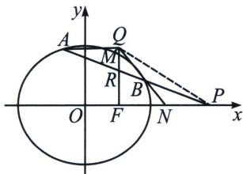
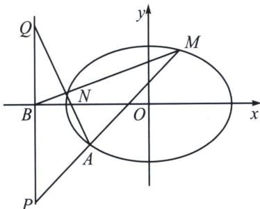

> [!faq]- 《圆锥曲线专题(上册)》例题解析
>
> > [!success]- **【答案】** 详见解析
>
> > [!note]- **【解析】**
> > 解析 (1) 设椭圆 $C$ 的左焦点为 $F_{1}$ , 点 $M\left(1, \frac{3}{2}\right)$ 在椭圆 $C$ 上, 且 $MF \perp x$ 轴, 则 $|F_{1}F| = 2$ , $|MF| = \frac{3}{2}$ ,
> >
> > 由勾股定理可知， $\left|MF_{1}\right|=\frac{5}{2}$ ，故 $2a=\left|MF_{1}\right|+\left|MF\right|=4$ ，解得 $a^{2}=4,\ b^{2}=a^{2}-1=3$ ，
> >
> > 故椭圆 C 的方程为 $\frac{x^{2}}{4} + \frac{y^{2}}{3} = 1$ ;
> >
> > 
> >
> > (2)
> > 解法一：(定比点差)设 $A(x_{1},y_{1})$ ， $B(x_{2},y_{2})$ ， $\overrightarrow{AP} = \lambda \overrightarrow{PB}$ ，则 $\left\{ \begin{array}{l} \frac{x_1 + \lambda x_2}{1 + \lambda} = 4 \\ \frac{y_1 + \lambda y_2}{1 + \lambda} = 0 \end{array} \right.$ ①，存在点 $R$ ，使得 $\overrightarrow{AR}$ $= -\lambda \overrightarrow{RB}$ , 则 $\left\{ \begin{array}{l} \frac{x_1 - \lambda x_2}{1 + \lambda} = x_R \\ \frac{y_1 - \lambda y_2}{1 + \lambda} = y_R \end{array} \right.$ ②, 又由 $\left\{ \begin{array}{l} \frac{x_1^2}{4} + \frac{y_1^2}{3} = 1 \\ \frac{(\lambda x_2)^2}{4} + \frac{(\lambda y_2)^2}{3} = \lambda^2 \end{array} \right.$ 可得, $\frac{1}{4} \cdot \frac{x_1 + \lambda x_2}{1 + \lambda} \cdot \frac{x_1 - \lambda x_2}{1 - \lambda} + \frac{1}{3} \cdot \frac{y_1 + \lambda y_2}{1 + \lambda} \cdot$ $\frac{y_1 - \lambda y_2}{1 - \lambda} = 1$ ③, 结合 ① ② ③ 可得, $\frac{x_P x_R}{4} = 1$ , 所以 $x_R = 1$ , 即 $\left\{ \begin{array}{l} x_1 = \frac{5}{2} + \frac{3}{2} \lambda \\ x_2 = \frac{5}{2} + \frac{3}{2\lambda} \\ y_1 + \lambda y_2 = 0 \end{array} \right.$ , 直线 $NB$ 的方程为 $y - 0 = \frac{y_2}{x_2 - \frac{5}{2}} (x - \frac{5}{2})$ , $MF \perp x$ 轴, 直线 $NB$ 与 $MF$ 交于 $Q$ , 则 $x_Q = 1$ , 故 $y_Q = \frac{3y_2}{5 - 2x_2} = -\lambda y_2 = y_1$ , 故 $AQ \perp y$ 轴. 例 8 (2020 北京) 已知椭圆 $C: \frac{x^2}{a^2} + \frac{y^2}{b^2} = 1$ 过点 $A(-2, -1)$ , 且 $a = 2b$ .
> >
> > (1)求椭圆 C 的方程;
> >
> > (2) 过点 $B(-4, 0)$ 的直线 l 交椭圆 C 于点 M, N, 直线 MA, NA 分别交直线 x = -4 于点 P, Q. 求 $\frac{|PB|}{|BQ|}$ 的值.
> >
> > 解析 (1) $\frac{x^2}{8} + \frac{y^2}{2} = 1$ ;
> >
> > 
> >
> > (2)令 $\overrightarrow{MB}=\lambda\overrightarrow{BN}$ ，设 $M(x_{1},y_{1})$ ， $N(x_{2},y_{2})$ ，根据定比点差法(略)可得： $x_{1}=-3-\lambda,\quad x_{2}=-3-\frac{1}{\lambda}$ ， $y_{1}+\lambda y_{2}=0$ 所以 AQ: $\frac{y_{Q}+1}{-2}=\frac{y_{2}+1}{-1-\frac{1}{\lambda}}=\frac{\lambda y_{2}+\lambda}{-1-\lambda}$ ①，AP: $\frac{y_{p}+1}{-2}=\frac{y_{1}+1}{-1-\lambda}$ ②，
> > - **①**：+②得： $\frac{y_{Q}+1}{-2}+\frac{y_{P}+1}{-2}=-1$ ，即 $y_{P}+y_{Q}=0$ ，所以 $\frac{|PB|}{|BQ|=1}$ .
