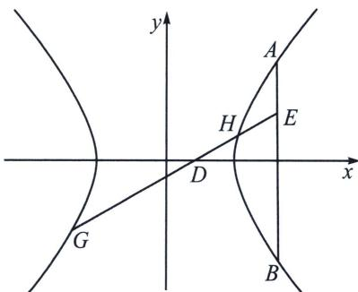

<!-- question-source:start -->
例3 (2023·四省联考)已知双曲线 $C: \frac{x^{2}}{a^{2}} - \frac{y^{2}}{b^{2}} = 1 (a > 0, b > 0)$ 过点 $A(4\sqrt{2}, 3)$ , 且焦距为 10.

(1)求 C 的方程;

(2)已知点 $B(4\sqrt{2}, -3)$ , $D(2\sqrt{2}, 0)$ , $E$ 为线段 $AB$ 上一点, 且直线 $DE$ 交 $C$ 于 $G$ , $H$ 两点. 证明: $\frac{|GD|}{|GE|} = \frac{|HD|}{|HE|}$ .

## 解析
(1) $\frac{x^2}{16} - \frac{y^2}{9} = 1$ ;

(2)解法一(参数同构) $\overrightarrow{DG}=\lambda\overrightarrow{GE},\overrightarrow{DH}=\mu\overrightarrow{HE}$ ，所以 $\left\{\begin{aligned}&x_{G}=\frac{2\sqrt{2}+4\sqrt{2}\lambda}{1+\lambda}\\&y_{G}=\frac{\lambda y_{E}}{1+\lambda}\end{aligned}\right.$ 代入双曲线方程得： $\lambda^2\left(1 - \frac{y_E^2}{9}\right) - \frac{1}{2} = 0$ ，同理， $\mu^2\left(1 - \frac{y_E^2}{9}\right) - \frac{1}{2} = 0$ ，所以 $\lambda, \mu$ 为同构方程 $x^{2}\left(1 - \frac{y_E^2}{9}\right) - \frac{1}{2} = 0$ 两根，所以 $\lambda + \mu = 0$ 。命题得证。
<!-- question-source:end -->

![[高中/总复习/专题/2026版高中《mst老唐说题》圆锥曲线专题（数学）/上册/第07章_圆锥曲线常规数据处理方法/第四节_定比点差法/二_调和点列与定比点差法/例题/answers/Q00048662A1.md]]
