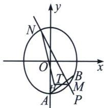

<!-- question-source:start -->
例11（2022·全国乙卷）已知椭圆 E 的中心为坐标原点，对称轴为 x 轴、y 轴，且过 A(0, -2)， $B\left(\frac{3}{2}, -1\right)$ 两点.

(1) 求 E 的方程;

(2)设过点 $P(1, -2)$ 的直线交 E 于 M, N 两点，过 M 且平行于 x 轴的直线与线段 AB 交于点 T，点 H 满足 $\overrightarrow{MT} = \overrightarrow{TH}$ . 证明：直线 HN 过定点.

(1) 设 $E: mx^2 + ny^2 = 1$ 过 $(0, -2)$ , $\left(\frac{3}{2}, 1\right)$ , 代入 $\begin{cases} 4n = 1 \\ \frac{9}{4}m + n = 1 \end{cases}$ 得: $\begin{cases} n = \frac{1}{4} \\ m = \frac{1}{3} \end{cases}$ , 所以 $\frac{x^2}{3} + \frac{y^2}{4} = 1$

(2)设 $M(x_{1},y_{1})$ ， $\overrightarrow{MP} = \lambda \overrightarrow{PN}$ ，则 $x_{1} + \lambda x_{2} = 1 + \lambda ,y_{1} + \lambda y_{2} = -2(1 + \lambda),$ $\left\{ \begin{array}{ll}\frac{x_1^2}{3} +\frac{y_1^2}{4} = 1①\\ \frac{\lambda^2x_2^2}{3} +\frac{\lambda^2y_2^2}{4} = \lambda^2② \end{array} \right.$ ①-②得

$$
\frac {(x _ {1} + \lambda x _ {2}) (x _ {1} - \lambda x _ {2})}{3} + \frac {(y _ {1} + \lambda y _ {2}) (y _ {1} - \lambda y _ {2})}{4} = 1 - \lambda^ {2} \Rightarrow \lambda = 2 x _ {1} - 3 y _ {1} - 7, N \left(\frac {x _ {1} - 3 y _ {1} - 6}{2 x _ {1} - 3 y _ {1} - 7}, \right.
$$

$\frac{-4x_1 + 5y_1 + 12}{2x_1 - 3y_1 - 7}$ 由题意可得： $T\left(\frac{3}{2} (y_1 + 2), y_1\right)$ 又 $\overrightarrow{MT} = \overrightarrow{TH}$ ，则 $H(3(y_1 + 2) - x_1, y_1)$ 设 $NH$ 过定点

$$
P (m, n) \Rightarrow \frac {y _ {1} - n}{- x _ {1} + 3 y _ {1} + 6 - m} = \frac {\frac {- 4 x _ {1} + 5 y _ {1} + 1 2}{2 x _ {1} - 3 y _ {1} - 7} - n}{\frac {x _ {1} - 3 y _ {1} - 6}{2 x _ {1} - 3 y _ {1} - 7} - m} = \frac {(- 4 - 2 n) x _ {1} + (5 + 3 n) y _ {1} + 7 n + 1 2}{(1 - 2 m) x _ {1} + (3 m - 3) y _ {1} + 7 m - 6} \Rightarrow - 4 - 2 n = 0
$$

得 $n = -2$ ，此时 $\frac{y_1 + 2}{-x_1 + 3y_1 + 6 - m} = \frac{y_1 + 2}{(2m - 1)x_1 + (3 - 3m)y_1 + 6 - 7m}$ ，对比得： $m = 0$ 。所以直线 $HN$ 过定点 $(0, -2)$

注意 这题探索定点其实很好分析计算，得到 $\frac{y_1 - n}{-x_1 + 3y_1 + 6 - m} = \frac{\frac{-4x_1 + 5y_1 + 12}{2x_1 - 3y_1 - 7} - n}{\frac{x_1 - 3y_1 - 6}{2x_1 - 3y_1 - 7} - m}$ 时，分子不含 $x_{1}$ ，故 $n = -2$ ，而 $m = 0$ 也可以秒断.
<!-- question-source:end -->

![[高中/总复习/专题/2026版高中《mst老唐说题》圆锥曲线专题（数学）/上册/第07章_圆锥曲线常规数据处理方法/第四节_定比点差法/四_非轴点弦三炮齐鸣数据/例题/answers/Q00048669A1.md]]
