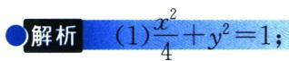
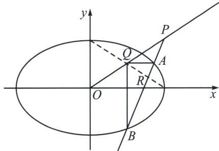

<!-- question-source:start -->
例12 (2024·成都三诊)已知椭圆 $C: \frac{x^{2}}{a^{2}} + \frac{y^{2}}{b^{2}} = 1 (a > b > 0)$ 的离心率为 $\frac{\sqrt{3}}{2}$ , 过点 $P(a, b)$ 的直线 $l$ 与椭圆 $C$ 交于 $A, B$ 两点, 当 $l$ 过坐标原点 $O$ 时, $|AB| = \sqrt{10}$ .

(I)求椭圆 C 的方程;

(2)线段 $OP$ 上是否存在定点 $Q$ , 使得直线 $QA$ 与直线 $QB$ 的斜率之积为定值. 若存在, 求出点 $Q$ 的坐标; 若不存在, 请说明理由.

<!-- question-source:end -->

![[高中/总复习/专题/2026版高中《mst老唐说题》圆锥曲线专题（数学）/上册/第07章_圆锥曲线常规数据处理方法/第四节_定比点差法/四_非轴点弦三炮齐鸣数据/例题/answers/Q00048670A1.md]]
