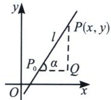
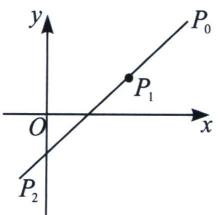
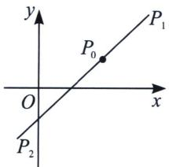

## 一、直线的参数方程形式与性质

直线：经过点 $P_0(x_0, y_0)$ ，倾斜角为 $\alpha$ 的直线的参数方程是 $\left\{ \begin{array}{l} x = x_0 + t\cos \alpha \\ y = y_0 + t\sin \alpha \end{array} \right.$ （ $t$ 为参数）.

注意：1. 在直线的参数方程 $\left\{ \begin{array}{l} x = x_0 + t\cos \alpha \\ y = y_0 + t\sin \alpha \end{array} \right.$ ( $t$ 为参数)中 $|t|$ 的几何意义是表示在直线上过定点 $P_0(x_0, y_0)$ 与直线上的任一点 $P(x, y)$ 构成的有向线段 $P_0P$ 的模，且在直线上任意两点 $P_1, P_2$ 的距离为 $|P_1P_2| = |t_1 - t_2| = \sqrt{(t_1 + t_2)^2 - 4t_1t_2}$ .

2. 若直线与已知二次曲线相交于 $A$ 、 $B$ 两点时，则将此直线代入二次曲线，得到两根 $t_1$ 和 $t_2$ ，则 $|AB| = |t_1 - t_2|$ .

3. 定点 $P_{0}$ 是线段 $AB$ 的中点可得 $t_{1} + t_{2} = 0$ ；设线段 $AB$ 中点为 $M$ ，则点 $M$ 对应的参数值 $t_{M} = \frac{t_{1} + t_{2}}{2}$ （由此可求 $|AB|$ 及中点坐标）.

注意 这里的参数 t 不一定是正数，关于 $\left|P_{1}P_{2}\right|=\left|t_{1}-t_{2}\right|=\sqrt{(t_{1}+t_{2})^{2}-4t_{1}t_{2}}$ ，如左图所示，当 $P_{0}$ 位于线段 $P_{1}P_{2}$ 外时， $t_{1}$ 和 $t_{2}$ 同号（可以都为负），当 $P_{0}$ 位于线段 $P_{1}P_{2}$ 内时， $t_{1}$ 和 $t_{2}$ 异号（一正一负）。这也是为什么，老教材区分了参数方程和极坐标，新教材虽然没有参数方程的篇章，但是三角换元这种思想一直存在于任何高考体系里，并且考场中直接用参数方程换元，是不会被扣分的。

![[高中/总复习/专题/2026版高中《mst老唐说题》圆锥曲线专题（数学）/上册/第08章_联立计算高阶篇/第一节_长度参数与直线参数方程/一_直线的参数方程形式与性质/例题/Q00053064.md]]
![[高中/总复习/专题/2026版高中《mst老唐说题》圆锥曲线专题（数学）/上册/第08章_联立计算高阶篇/第一节_长度参数与直线参数方程/一_直线的参数方程形式与性质/例题/Q00053065.md]]
