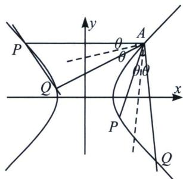

> [!faq]- 《圆锥曲线专题(上册)》例题解析
>
> > [!success]- **【答案】** 详见解析
>
> > [!note]- **【解析】**
> > 解析 (1)将点 $A(2, 1)$ 代入双曲线方程得: $C: \frac{x^{2}}{2} - y^{2} = 1$ , 将圆形按向量 $\overrightarrow{AO} = (-2, -1)$ 平移, $C \rightarrow$
> >
> > $C'$ ，即 $\frac{(x+2)^{2}}{2}-(y+1)^{2}=1$ ，即 $\frac{x^{2}}{2}-y^{2}+2x-2y=0$ ；设PQ平移后直线为 $P'Q'$ ，令 $P'Q'$ 方程为： $mx+ny=1$ ，即 $\frac{x^{2}}{2}-y^{2}+(2x-2y)(mx+ny)=0$ ， $(1+2n)y^{2}-(2n-2m)xy-\left(\frac{1}{2}+2m\right)x^{2}=0$ ，当 $x\neq0$ 时，同除以 $x^{2}$ ，得： $(1+2n)\left(\frac{y}{x}\right)^{2}+2(m-n)\frac{y}{x}-\frac{1}{2}-2m=0$ ； $k_{AP}+k_{AQ}=\frac{2n-2m}{1+2n}=0$ ，所以n=m， $k_{l}=-\frac{m}{n}=-1.$ (2) $k_{l}=-1<-\frac{\sqrt{2}}{2}$ ，①若PQ与左支交于两点，不成立，②若PQ与右支交于两点．如图：
> >
> > 
> >
> > $\tan 2\theta = \frac{2\tan\theta}{1 - \tan^2\theta} = 2\sqrt{2}$ 得： $\tan \theta = \frac{\sqrt{2}}{2}$ ，不妨设 $P$ 在 $Q$ 上方
> >
> > 所以 $k_{AP} = \frac{1}{\frac{\sqrt{2}}{2}} = \sqrt{2}\Rightarrow \left\{ \begin{array}{l}\cos \theta_1 = \frac{\sqrt{3}}{3}\\ \sin \theta_1 = \frac{\sqrt{6}}{3} \end{array} \right.$ ， $k_{AQ} = -\frac{1}{\frac{\sqrt{2}}{2}} = -\sqrt{2}\Rightarrow \left\{ \begin{array}{l}\cos \theta_2 = -\frac{\sqrt{3}}{3}\\ \sin \theta_2 = \frac{\sqrt{6}}{3} \end{array} \right.$
> >
> > 所以 $l_{AP}:\left\{\begin{aligned}&x=2+\frac{\sqrt{3}}{3}t\\&y=1+\frac{\sqrt{6}}{3}t\end{aligned}\right.$ ，代入双曲线方程得： $\frac{t^{2}}{2}-\frac{2-2\sqrt{2}}{\sqrt{3}}t=0,\quad t_{1}=\frac{4-4\sqrt{2}}{\sqrt{3}}$
> >
> > 同理， $l_{AQ}:\left\{\begin{aligned}x&=2-\frac{\sqrt{3}}{3}t\\ y&=1+\frac{\sqrt{6}}{3}t\end{aligned}\right.$ ，代入双曲线方程得： $\frac{t^{2}}{2}+\frac{2\sqrt{2}+2}{\sqrt{3}}t=0,\quad t_{2}=-\frac{4+4\sqrt{2}}{\sqrt{3}}$
> >
> > $$
> > S = \frac {1}{2} | A P | \cdot | A Q | \sin 2 \theta = \frac {1}{2} | t _ {1} | | t _ {2} | \frac {2 \sqrt {2}}{3} = \frac {1 6 \sqrt {2}}{9}
> > $$
