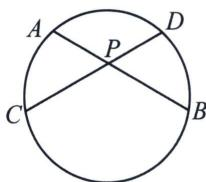
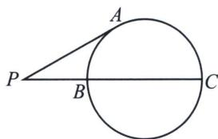
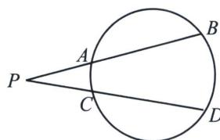

<!-- question-source:start -->
例3（2021·新高考Ⅰ卷）在平面直角坐标系 $xOy$ 中，已知点 $F_{1}(-\sqrt{17}, 0)$ ， $F_{2}(\sqrt{17}, 0)$ ，点 $M$ 满足 $|MF_{1}| - |MF_{2}| = 2$ 。记 $M$ 的轨迹为 $C$ 。

(1) 求 C 的方程;

(2)设点 T 在直线 $x=\frac{1}{2}$ 上，过 T 的两条直线分别交 C 于 A, B 两点和 P, Q 两点，且 $|TA|\cdot|TB|=|TP|\cdot|TQ|$ ，求直线 AB 的斜率与直线 PQ 的斜率之和.

(1)由双曲线的定义可知， $M$ 的轨迹 $C$ 是双曲线的右支，设 $C$ 的方程为 $\frac{x^2}{a^2} -\frac{y^2}{b^2} = 1(a > 0,b > 0)$ 根据题意 $\left\{ \begin{array}{l}c = \sqrt{17}\\ 2a = 2\\ c^2 = a^2 +b^2 \end{array} \right.$ ，解得 $\left\{ \begin{array}{ll}a = 1\\ b = 4\\ c = \sqrt{17} \end{array} \right.$ ，故 $C$ 的方程为 $x^{2} - \frac{y^{2}}{16} = 1(x\geqslant 1)$

(2)设 $T\left(\frac{1}{2}, m\right)$ , $l_{AB}: \begin{cases} x = \frac{1}{2} + t\cos \alpha \\ y = m + t\sin \alpha \end{cases}$ (t 为参数)，代入双曲线方程得 $16\left(\frac{1}{2} + t\cos \alpha\right)^2 - (m + t\sin \alpha)^2 =$ 即 $t^2(16\cos^2\alpha - \sin^2\alpha) + t(16\cos \alpha - 2m\sin \alpha) - m^2 - 12 = 0$ ，TA、TB 对应的参数为 $t_1, t_2$ ，

$|TA|\cdot|TB|=t_{1}t_{2}=\frac{-m^{2}-12}{16\cos^{2}\alpha-\sin^{2}\alpha}=\frac{-m^{2}-12}{17\cos^{2}\alpha-1}$ ，同理 $l_{PQ}:\left\{\begin{aligned}&x=\frac{1}{2}+t\cos\beta\\&y=m+t\sin\beta\end{aligned}\right.$ （t为参数），设TP、TQ对
应的参数为 $t_{3}$ ， $t_{4}$ ， $|TP|\cdot|TQ|=t_{3}t_{4}=\frac{-m^{2}-12}{17\cos^{2}\beta-1}$ ，因为 $|TA|\cdot|TB|=|TP|\cdot|TQ|$ ， $\frac{-m^{2}-12}{17\cos^{2}\alpha-1}=\frac{-m^{2}-12}{17\cos^{2}\beta-1}$ ，故 $\cos^{2}\alpha=\cos^{2}\beta$ ，因为 $\alpha\neq\beta$ ，所以 $\alpha+\beta=\pi$ ，所以 $k_{1}=-k_{2}$ ，所以 $k_{1}+k_{2}=0$ .

## 四点共圆一定满足相交弦定理或者切割线定理，一定能得出 $\alpha + \beta = 180^{\circ}$

补充: 圆幂定理 ①相交弦定理: 圆内的两条相交弦 $AB$ 与 $CD$ 交于 $P$ , 则 $|PA| \cdot |PB| = |PC| \cdot |PD|$ (左图).

②切割线定理: 从圆外一点 $P$ 引圆的切线 $PA$ 和割线交圆于 $B 、 C$ 两点, 则 $\left| PA \right|^2 = \left| PB \right| \cdot \left| PC \right|$ (中图).

③割线定理: 从圆外一点 $P$ 引两条割线与圆分别交于 $A 、 B$ 和 $C 、 D$ , 则 $|PA| \cdot |PB| = |PC| \cdot |PD|$ (右图).
<!-- question-source:end -->

![[高中/总复习/专题/2026版高中《mst老唐说题》圆锥曲线专题（数学）/上册/第08章_联立计算高阶篇/第一节_长度参数与直线参数方程/二_直线参数方程与四点共圆/例题/answers/Q00048675A1.md]]
