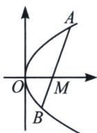

<!-- question-source:start -->
例7 (2024·河北月考)已知抛物线 $C: y^{2} = 4x$ , 点 $M(m, 0)$ 在 $x$ 轴的正半轴上, 过 $M$ 的直线 $l$ 与 $C$ 相交于 $A 、 B$ 两点, $O$ 为坐标原点.

(1) 若 m=1，且直线 l 的斜率为 1，求以 AB 为直径的圆的方程；

(2)问是否存在定点 M，不论直线 l 绕点 M 如何转动，使得 $\frac{1}{|AM|^{2}} + \frac{1}{|BM|^{2}}$ 恒为定值.

<!-- question-source:end -->

![[高中/总复习/专题/2026版高中《mst老唐说题》圆锥曲线专题（数学）/上册/第08章_联立计算高阶篇/第一节_长度参数与直线参数方程/四_参数方程解决共线分弦定点定值/例题/answers/Q00053070A1.md]]
