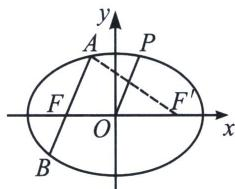

<!-- question-source:start -->
例1 (2021·佛山模拟)已知椭圆 $C: \frac{x^{2}}{a^{2}} + \frac{y^{2}}{b^{2}} = 1 (a > b > 0)$ 的某三个顶点形成边长为 2 的正三角形,

O 为 C 的中心.

(1)求椭圆 C 的方程;

(2) $P$ 在 $C$ 上, 过 $C$ 的左焦点 $F$ 且平行于 $OP$ 的直线与 $C$ 交于 $A$ , $B$ 两点, 是否存在常数 $\lambda$ , 使得 $|AF| \cdot |BF| = \lambda |OP|^2$ ? 若存在, 求出 $\lambda$ 的值; 若不存在, 说明理由.

(1)当三顶点为长轴两顶点和短轴一顶点时, 因为 $\frac{b}{a} = \sqrt{3}$ , 所以 $b = \sqrt{3} a > a$ , 此时不可能为正三角形, 所以正三角形的三顶点只能是短轴两顶点和长轴一顶点, 依题意可得 $b = 1$ , $a = \frac{\sqrt{3}}{2} \times 2 b = \sqrt{3}$ , 故椭圆 $C$ 的方程为 $\frac{x^2}{3} + y^2 = 1$ ;

(2)设 $z_{P} = x + y\mathrm{i} = r(\cos \theta +\mathrm{i}\sin \theta)$ ，即 $P(r\cos \theta ,r\sin \theta)$ ，代入椭圆方程 $\frac{x^2}{3} +y^2 = 1$ ，整理得：

$r^{2}=|OP|^{2}=\frac{3}{3\sin^{2}\theta+\cos^{2}\theta}=\frac{3}{3-2\cos^{2}\theta}$ ，补出另一个焦点 $F'$ ，则 $|AF'|=2\sqrt{3}-|AF|$ ，

在 $\triangle AFF'$ 中，利用余弦定理得：

$\left|AF\right|^{2} + (2\sqrt{2})^{2} - (2\sqrt{3} - \left|AF\right|)^{2} = 2\times 2\sqrt{2}\cdot \left|AF\right|\cdot \cos \theta ,$ 即 $\left|AF\right| = \frac{1}{\sqrt{3} - \sqrt{2}\cos\theta}$ ，同理可得：

$|BF|=\frac{1}{\sqrt{3}+\sqrt{2}\cos\theta},\quad|AF|\cdot|BF|=\frac{1}{3-2\cos^{2}\theta},\quad$ 故 $|AF|\cdot|BF|=\frac{1}{3}|OP|^{2},\quad$ 所以存在常数 $\lambda=\frac{1}{3},$ 使得 $\left|AF\right|\cdot\left|BF\right|=\lambda\left|OP\right|^{2}.$
<!-- question-source:end -->

![[高中/总复习/专题/2026版高中《mst老唐说题》圆锥曲线专题（数学）/上册/第08章_联立计算高阶篇/第三节_复数变换与三角旋转/二_复数变换处理平行问题/例题/answers/Q00048696A1.md]]
