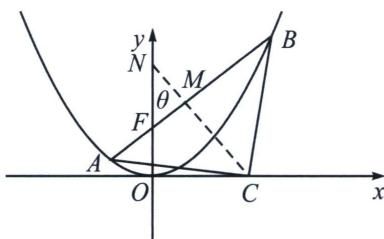

<!-- question-source:start -->
例9 (2025·成都零诊)已知抛物线 $E: x^{2} = 2py (p > 0)$ 的焦点为 $F$ , 过 $F$ 的直线与抛物线 $E$ 相交于 $A$ , $B$ 两点.

(1)当直线 AB 的倾斜角为 $\frac{\pi}{4}$ 时，直线 AB 被圆 $x^{2} + y^{2} - 4y = 0$ 所截得的弦长为 $\sqrt{14}$ ，求 p 的值；

(2)若点 C 在 x 轴上，且 $\triangle ABC$ 是以 C 为直角顶点的等腰直角三角形，求直线 AB 的斜率.

(1)因为直线 $AB$ 的倾斜角为 $\frac{\pi}{4}$ , 所以 $k_{AB} = 1$ . 由题意, 抛物线 $E$ 的焦点 $F$ 坐标为 $\left(0, \frac{p}{2}\right)$ .

所以直线 AB 的方程为 $y=x+\frac{p}{2}$ ，因为圆的方程为 $x^{2}+y^{2}-4y=0$ ，即 $x^{2}+(y-2)^{2}=4$ ，所以圆心坐标为 $(0,2)$ ，半径为 2，所以圆心到直线 AB 的距离 $d=\frac{\left|2-\frac{p}{2}\right|}{\sqrt{2}}$ ，由垂径定理得 $d^{2}+\left(\frac{\sqrt{14}}{2}\right)^{2}=4$ ，解得 p=2 或 p=6。

(2)解法一: (焦点弦中垂线截距定理)设 $AB$ 倾斜角为 $\theta$ , 根据中垂线截距定理可得: $\frac{|NF|}{|AB|} = \frac{1}{2}$ (自证), 根据焦长公式, $|AF| = \frac{p}{1 + \sin \theta}$ , $|BF| = \frac{p}{1 - \sin \theta}$ , $|AB| = \frac{2p}{\cos^2 \theta}$ , $|CN| = \frac{\frac{1}{2}|AB| + \frac{p}{2}}{\cos \theta} = \frac{p}{\cos^3 \theta} + \frac{p}{2\cos \theta}$ , $|MN| = |NF|\cos \theta = \frac{p}{\cos \theta}$ , $|CM| = |CN| - |MN| = \frac{p}{\cos^3 \theta} + \frac{p}{2\cos \theta} - \frac{p}{\cos \theta} = \frac{p}{\cos^3 \theta} - \frac{p}{2\cos \theta} = \frac{|AB|}{2} = \frac{p}{\cos^2 \theta}$ , 所以 $\frac{1}{\cos^2 \theta} - \frac{1}{\cos \theta} - \frac{1}{2} = 0$ , $\frac{1}{\cos \theta} = \frac{2}{\sqrt{3} + 1}$ , $\cos \theta = \sqrt{3} - 1$ , 此时 $k = \pm \frac{\sqrt[4]{12}}{2}$ , 或者 $\cos \theta = -(\sqrt{3} + 1)$ (舍) 注意: 利用 $\frac{1}{\cos \theta} = sec \theta = \sqrt{1 + \tan^2 \theta} = \frac{2}{\sqrt{3} + 1}$ 能快速计算出结果. 解法二(复数旋转)设 $C(m, 0)$ , $z_{CB} = a + bi$ , 根据题意可知: $z_{CA} = z_{CB} \cdot (\cos 90^\circ + i\sin 90^\circ) = -b + ai$ , 故 $\left\{ \begin{array}{l} x_B - m = a \\ y_B = b \end{array} \right. \Rightarrow \left\{ \begin{array}{l} x_B = m + a \\ y_B = b \end{array} \right.$ , $\left\{ \begin{array}{l} x_A - m = -b \\ y_A = a \end{array} \right. \Rightarrow \left\{ \begin{array}{l} x_A = m - b \\ y_A = a \end{array} \right.$ ,

$$
\left\{ \begin{array}{l} x ^ {2} = 2 p y \\ y = k x + \frac {p}{2} \end{array} \Rightarrow x ^ {2} - 2 p k x - p ^ {2} = 0, | a + b | = \sqrt {4 p ^ {2} k ^ {2} + 4 p ^ {2}} = 2 p \sqrt {1 + k ^ {2}} ①, \right.
$$

$$
y _ {A} - y _ {B} = a - b = k (x _ {A} - x _ {B}) = - k (a + b) \Rightarrow | a + b | = \frac {| a - b |}{k} ②
$$

由于 $AB$ 过 $F\left(0, \frac{p}{2}\right)$ ，利用抛物线两点联立式 $(x_A + x_B)x = 2py + x_Ax_B$ 可知 $x_Ax_B = -p^2$ ， $y_Ay_B = ab = \frac{p^2}{4}$ ③，综合①②③，所以 $|a + b|^2 = \frac{|a - b|^2}{k^2} = \frac{|a + b|^2 - 4ab}{k^2} \Rightarrow (k^2 - 1)|a + b|^2 = 4p^2(k^2 - 1)(k^2 + 1) = -p^2$ ， $k^4 = \frac{3}{4}$ ， $k = \pm \frac{\sqrt[4]{12}}{2}$ .
<!-- question-source:end -->

![[高中/总复习/专题/2026版高中《mst老唐说题》圆锥曲线专题（数学）/上册/第08章_联立计算高阶篇/第三节_复数变换与三角旋转/五_复数旋转下的等腰直角三角形/例题/answers/Q00048704A1.md]]
