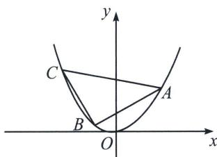

<!-- question-source:start -->
例10（2022·德州三模）已知 F 为抛物线 $\Gamma: x^{2}=2py(p>0)$ 的焦点，点 P 在抛物线 $\Gamma$ 上，O 为坐标原点， $\triangle OPF$ 的外接圆与抛物线 $\Gamma$ 的准线相切，且该圆周长为 $3\pi$ .

(1)求抛物线 $\Gamma$ 的方程;

(2)如图, 设点 $A, B, C$ 都在抛物线 $\Gamma$ 上, 若 $\triangle ABC$ 是以 $AC$ 为斜边的等腰直角三角形, 求 $\overrightarrow{AB} \cdot \overrightarrow{AC}$ 的最小值.

(1)已知 $F$ 为抛物线 $\Gamma: x^{2} = 2py (p > 0)$ 的焦点, 点 $P$ 在抛物线 $\Gamma$ 上, $O$ 为坐标原点, $\triangle OPF$ 的外接圆与抛物线 $\Gamma$ 的准线相切, 且该圆周长为 $3\pi$ . $F\left(0, \frac{p}{2}\right)$ , 圆心在直线 $y = \frac{p}{4}$ 上, 又外接圆与准线 $y = -\frac{p}{2}$ 相切, 所以半径为 $\frac{p}{4} + \frac{p}{2} = \frac{3}{4} p$ , 所以周长为 $2\pi \cdot \frac{3}{4} p = 3\pi$ , 所以 $p = 2$ , 故抛物线方程为 $x^{2} = 4y$ ;

(2)设 $B(x_0, y_0)$ , $z_{BA} = a + bi$ , 根据题意可知: $z_{BC} = z_{BA} \cdot (\cos 90^\circ + i \sin 90^\circ) = -b + ai$ (复数三角变换), 故 $\left\{ \begin{array}{l} x_A - x_0 = a \\ y_A - y_0 = b \end{array} \right. \Rightarrow \left\{ \begin{array}{l} x_A = x_0 + a \\ y_A = y_0 + b \end{array} \right.$ , $\left\{ \begin{array}{l} x_C - x_0 = -b \\ y_C - y_0 = a \end{array} \right. \Rightarrow \left\{ \begin{array}{l} x_C = x_0 - b \\ y_C = y_0 + a \end{array} \right.$ , 我们将 $A(x_0 + a, y_0 + b)$ 、 $C(x_0 - b, y_0 + a)$ 两点代入抛物线得: $\left\{ \begin{array}{l} (x_0 + a)^2 = 4(y_0 + b) \\ (x_0 - b)^2 = 4(y_0 + a) \end{array} \right. \Rightarrow x_0 = -\frac{a^2 - 4b}{2a} = \frac{b^2 - 4a}{2b} \Rightarrow ab(a + b) = 4(a^2 + b^2)$ , 根据题意, 我们需要 $\overrightarrow{AB} \cdot \overrightarrow{AC} = |\overrightarrow{AB}|^2 = a^2 + b^2$ , 所以利用基本不等式将 $\frac{a^2 + b^2}{2} \geqslant ab$ 以及 $\frac{a^2 + b^2}{2} \geqslant \left(\frac{a + b}{2}\right)^2$ 代入替换得: $\frac{a^2 + b^2}{2} \cdot 2\sqrt{\frac{a^2 + b^2}{2}} \geqslant 4(a^2 + b^2)$ , 即 $a^2 + b^2 \geqslant 32$ , 当且仅当 $a = b = 4$ 时等号成立.
<!-- question-source:end -->

![[高中/总复习/专题/2026版高中《mst老唐说题》圆锥曲线专题（数学）/上册/第08章_联立计算高阶篇/第三节_复数变换与三角旋转/五_复数旋转下的等腰直角三角形/例题/answers/Q00048705A1.md]]
