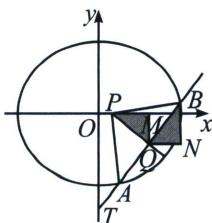

<!-- question-source:start -->
例11 (2024·北京怀柔区模拟)已知椭圆 $C: \frac{x^{2}}{4} + \frac{y^{2}}{3} = 1$ .

(1)求椭圆 C 的离心率和长轴长.

(2)已知直线 y=kx-2 与椭圆 C 有两个不同的交点 A, B, P 为 x 轴上一点. 是否存在实数 k，使得 $\triangle PAB$ 是以点 P 为直角顶点的等腰直角三角形？若存在，求出 k 的值及点 P 的坐标；若不存在，说明理由.

<!-- question-source:end -->

![[高中/总复习/专题/2026版高中《mst老唐说题》圆锥曲线专题（数学）/上册/第08章_联立计算高阶篇/第三节_复数变换与三角旋转/五_复数旋转下的等腰直角三角形/例题/answers/Q00053086A1.md]]
