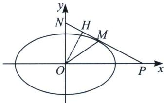

<!-- question-source:start -->
例6 (2022·天津卷)椭圆 $\frac{x^2}{a^2} +\frac{y^2}{b^2} = 1(a > b > 0)$ 离心率为 $\frac{\sqrt{6}}{3}$ , 直线 $l$ 与椭圆有唯一公共点 $M$ , 与 $y$ 轴交于点 $N(N$ 异于 $M$ ), 记 $O$ 为原点, 若 $|OM| = |ON|$ , 且 $\triangle OMN$ 面积为 $\sqrt{3}$ , 求椭圆方程.

<!-- question-source:end -->

![[高中/总复习/专题/2026版高中《mst老唐说题》圆锥曲线专题（数学）/上册/第08章_联立计算高阶篇/第三节_复数变换与三角旋转/四_复数代换下的切线几何性质挖掘/例题/answers/Q00048701A1.md]]
