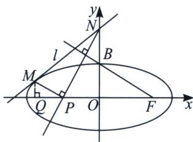

<!-- question-source:start -->
例7（2021·天津）已知椭圆 $\frac{x^2}{a^2} +\frac{y^2}{b^2} = 1(a > b > 0)$ 中， $e = \frac{2\sqrt{5}}{5}$ ，其上顶点为 $B$ ，右焦点为 $F$ ，且 $|BF| = 2\sqrt{5}$

(1)求椭圆的方程;

(2)若直线 l 与椭圆有唯一公共点 M，l 与 y 轴正半轴交于点 N，过 N 作 BF 的垂线，交 x 轴于点 P，已知 $MP \parallel BF$ ，求直线 l 的方程.

(1)由题意知 $B(0, b)$ , $F(c, 0)$ , 所以 $|BF| = \sqrt{c^2 + b^2} = a = 2\sqrt{5}$ , $e = \frac{c}{a} = \frac{2\sqrt{5}}{5}$ , 所以 $c = 4$ , $b^2 = a^2 - c^2 = 20 - 16 = 4$ , 因此椭圆方程为: $\frac{x^2}{20} + \frac{y^2}{4} = 1$ .

(2)令 $z_{PM} = r(\cos \theta +\mathrm{i}\sin \theta)$ ，所以 $M(r\cos \theta +x_P,r\sin \theta)$ ， $MP / / BF$ ，故 $\cos \theta = -\frac{2}{\sqrt{5}}$ ， $\sin \theta = \frac{1}{\sqrt{5}}$ ，即 $M\left(-\frac{2}{\sqrt{5}} r + x_P,\frac{1}{\sqrt{5}} r\right)$ ，由于 $MP\bot PN$ ，故 $|ON| = 2|OP|$ ，根据椭圆切线方程 $\frac{xx_M}{20} +\frac{yy_M}{4} = 1$ （请自证），当 $x$ =0 时， $|ON|=y_{N}=-2x_{P}=\frac{4}{y_{M}}=\frac{4\sqrt{5}}{r}$ ，所以 $x_{P}=-\frac{2\sqrt{5}}{r}$ ，由于 $M\left(-\frac{2}{\sqrt{5}}r-\frac{2\sqrt{5}}{r},\frac{1}{\sqrt{5}}r\right)$ 在椭圆上，所以代入椭圆得： $\frac{9}{100}r^{4}-\frac{3}{5}r^{2}+1=0,\left(\frac{3}{10}r^{2}-1\right)^{2}=0,r^{2}=\frac{10}{3}$ ，所以 $M\left(-\frac{10}{\sqrt{6}},\frac{2}{\sqrt{6}}\right)$ ，得： $l_{MN}$ 的方程为： $x-y+2\sqrt{6}=0$ 。

注意 参数方程和复数变换，一个在于代数，一个在于几何条件挖掘，大家可以自行选取方法.
<!-- question-source:end -->

![[高中/总复习/专题/2026版高中《mst老唐说题》圆锥曲线专题（数学）/上册/第08章_联立计算高阶篇/第三节_复数变换与三角旋转/四_复数代换下的切线几何性质挖掘/例题/answers/Q00048702A1.md]]
