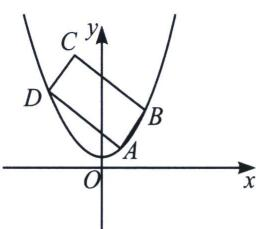
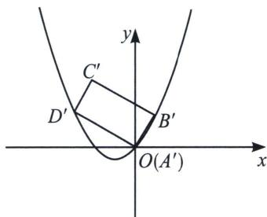

> [!faq]- 《圆锥曲线专题(上册)》例题解析
>
> > [!success]- **【答案】** 详见解析
>
> > [!note]- **【解析】**
> > 解析 (1)设点 $P$ 点坐标为 $(x, y)$ , 由题意得 $|y| = \sqrt{x^2 + \left(y - \frac{1}{2}\right)^2}$ , 两边平方可得: $y^2 = x^2 + y^2 - y + \frac{1}{4}$ ,
> >
> > 化简得： $y=x^{2}+\frac{1}{4}$ ，符合题意。故 W 的方程为 $y=x^{2}+\frac{1}{4}$ 。
> >
> > 
> >
> > 
> >
> > (2)本题方法众多, 篇幅有限, 本题选择最优解, 由于垂直关系的长度关系, 故选择复数变换最为简单. 欲证命题为 $|AB| + |AD| > \frac{3\sqrt{3}}{2}$ . 由图象的平移可知, 将抛物线 $W$ 看作 $y = x^2$ 不影响矩形的周长. 设 $A(m, m^2)$ 为垂足, 将抛物线按照向量 $\overrightarrow{AO} = (-m, -m^2)$ 平移得: $y = x^2 + 2mx$ ,
> >
> > 令 $z_{B'} = x_{B'} + y_{B'}\mathrm{i} = r_1(\cos \theta +\mathrm{i}\sin \theta)$ ，所以 $B^{\prime}(r_{1}\cos \theta ,r_{1}\sin \theta),z_{D^{\prime}} = x_{D^{\prime}} + y_{D^{\prime}}\mathrm{i} = r_{2}\left(\cos \left(\theta +\frac{\pi}{2}\right) + \mathrm{i}\sin \left(\theta +\right.\right.$ $\frac{\pi}{2}\Big)\Big)$ ，所以 $D^{\prime}(-r_{2}\sin \theta ,r_{2}\cos \theta)$ ，代入方程 $y = x^{2} + 2mx$ 得： $\left\{ \begin{array}{l}r_1 = \frac{\sin\theta - 2m\cos\theta}{\cos^2\theta}\\ r_2 = \frac{\cos\theta + 2msin\theta}{\sin^2\theta} \end{array} \right.$
> >
> > $r_{1}+r_{2}=\left|\frac{\sin\theta-2m\cos\theta}{\cos^{2}\theta}\right|+\left|\frac{\cos\theta+2m\sin\theta}{\sin^{2}\theta}\right|$ ，根据绝对值函数性质，若 $f(x)=p|x-a|+q|x-b|(p>0,q>0)$ ，最小值一定取在绝对值零点处，即x=a或x=b处，所以当 $m=\frac{\sin\theta}{2\cos\theta}$ 或者 $m=-\frac{\cos\theta}{2\sin\theta}$ 时，取得最小值；
> > - **①**：当 $m = \frac{\sin\theta}{2\cos\theta}$ 时，要证明不等式 $\left|\frac{1}{\cos\theta} +\frac{\cos\theta}{\sin^2\theta}\right| > \frac{3\sqrt{3}}{2}$ ，即证 $\left|\frac{1}{\cos\theta\sin^2\theta}\right| > \frac{3\sqrt{3}}{2}$ ，根据均值不等式，有$\left|\cos\theta\sin^{2}\theta\right|=\frac{1}{\sqrt{2}}.\quad\sqrt{2\cos^{2}\theta(1-\cos^{2}\theta)(1-\cos^{2}\theta)}\leqslant\frac{1}{\sqrt{2}}.\quad\sqrt{\left(\frac{2}{3}\right)^{3}}=\frac{2}{3\sqrt{3}}$ ，由题意， $r_{1}$ 不可能为0，等号取不到；
> > - **②**：当 $m=-\frac{\cos\theta}{2\sin\theta}$ 时，要证明不等式 $\left|\frac{1}{\sin\theta}+\frac{\sin\theta}{\cos^{2}\theta}\right|>\frac{3\sqrt{3}}{2}$ ，即证 $\left|\frac{1}{\cos^{2}\theta\sin\theta}\right|>\frac{3\sqrt{3}}{2}$ ，根据均值不等式，有 $\left|\cos^{2}\theta\sin\theta\right|=\frac{1}{\sqrt{2}}.\quad\sqrt{2\sin^{2}\theta(1-\sin^{2}\theta)(1-\sin^{2}\theta)}\leqslant\frac{1}{\sqrt{2}}.\quad\sqrt{\left(\frac{2}{3}\right)^{3}}=\frac{2}{3\sqrt{3}}$ ，由题意， $r_{2}$ 不可能为0，等号取不到；故原命题得证.
