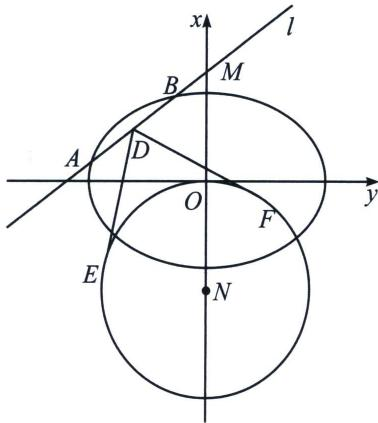

<!-- question-source:start -->
例6 (2017·山东)在平面直角坐标系 $xOy$ 中, 已知椭圆 $C: \frac{x^2}{a^2} + \frac{y^2}{b^2} = 1 (a > b > 0)$ 的离心率为 $\frac{\sqrt{2}}{2}$ , 椭圆 $C$ 截直线 $y = 1$ 所得线段的长度为 $2\sqrt{2}$ .

(1)求椭圆 C 的方程;

(2)动直线 $l: y = kx + m (m \neq 0)$ 交椭圆 $C$ 于 $A, B$ 两点，交 $y$ 轴于点 $M$ 。点 $N$ 是 $M$ 关于 $O$ 的对称点， $\odot N$ 的半径为 $|NO|$ 。设 $D$ 为 $AB$ 的中点， $DE, DF$ 与 $\odot N$ 分别相切于点 $E, F$ ，求 $\angle EDF$ 的最小值。

(1)因为椭圆 $C$ 的离心率为 $\frac{\sqrt{2}}{2}$ , 所以 $\frac{a^2 - b^2}{a^2} = \frac{1}{2}, a^2 = 2b^2$ , 因为椭圆 $C$ 截直线 $y = 1$ 所得线段的长度为 $2\sqrt{2}$ ，所以椭圆 C 过点 $(\sqrt{2}, 1)$ ，所以 $\frac{2}{a^{2}} + \frac{1}{b^{2}} = 1$ ，所以 $b^{2} = 2, a^{2} = 4$ ，所以椭圆 C 的方程为 $\frac{x^{2}}{4} + \frac{y^{2}}{2} = 1$ .

(2)设则 $A(x_{1},y_{1}),B(x_{1},y_{1}),D(x_{0},y_{0}),M(0,m)$ ，则 $N(0, - m)$ ，所以 $\odot N$ 的半径为 $|m|$ ， $\left\{ \begin{array}{l}\frac{x_1^2}{4} +\frac{y_1^2}{2} = 1\\ \frac{x_2^2}{4} +\frac{y_2^2}{2} = 1 \end{array} \right.$ ，两式相减得： $\frac{x_1^2 - x_2^2}{4} +\frac{y_1^2 - y_2^2}{2} = 0$ ，所以 $\frac{y_1 + y_2}{x_1 + x_2}\cdot \frac{y_1 - y_2}{x_1 - x_2} = \frac{y_0}{x_0}\cdot k = \frac{y_0}{x_0}\cdot \frac{y_0 - m}{x_0} = -\frac{1}{2}$ ，故点 $D$ 的轨迹方程为： $\frac{x_0^2}{2} +\left(y_0 - \frac{m}{2}\right)^2 = \frac{m^2}{4}$ ；令 $\left\{ \begin{array}{l}x_0 = \frac{m}{\sqrt{2}}\cos \alpha \\ y_0 = \frac{m}{2} (\sin \alpha +1) \end{array} \right.$ （α为参数）， $|DN|^2 = \left(\frac{m}{\sqrt{2}}\cos \alpha\right)^2 +\left(\frac{m\sin\alpha}{2} +\frac{3m}{2}\right)^2 = -\frac{m^2}{4}\sin^2\alpha +\frac{3m^2}{2}\sin \alpha +\frac{11m^2}{4},\quad \left|\frac{EN|^2}{DN|^2} = \frac{m^2}{m^2\left(-\frac{1}{4}\sin^2\alpha +\frac{3}{2}\sin\alpha + \frac{11}{4}\right)}\geqslant$ $\frac{1}{4}$ ，当 $\sin \alpha = 1$ 时，等号成立，此时 $\frac{|EN|}{|DN|} = \frac{1}{2},\sin \angle EDN\geqslant \frac{1}{2}$ ，所以∠EDF的最小值是 $60^{\circ}$

注意 中点弦的轨迹方程，在上一章已经介绍，就是椭圆的中点弦+定点的轨迹方程也是一个小椭圆，这一点是解决此题的关键，参数方程就是构造了三角函数进行简化的处理结果。
<!-- question-source:end -->

![[高中/总复习/专题/2026版高中《mst老唐说题》圆锥曲线专题（数学）/上册/第08章_联立计算高阶篇/第二节_单动点与圆锥曲线参数方程/三_隐藏的轨迹方程与单动点三角换元/例题/answers/Q00048688A1.md]]
