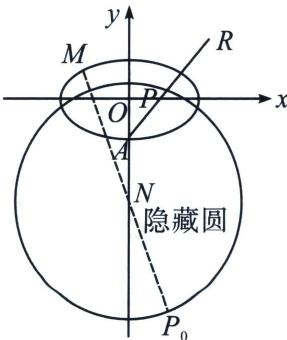

> [!faq]- 《圆锥曲线专题(上册)》例题解析
>
> > [!success]- **【答案】** 详见解析
>
> > [!note]- **【解析】**
> > 解析 (1)由题可得： $\left\{ \begin{array}{l} \sqrt{a^2 + b^2} = \sqrt{10}\\ e = \frac{c}{a} = \frac{2\sqrt{2}}{3}\\ a^2 = b^2 +c^2 \end{array} \right.$ ， $a^2 = 9$ ； $b^{2} = 1$ ，故椭圆 $C$ 的方程： $\frac{x^2}{9} +y^2 = 1$
> >
> > (2) (i)
> > 解法一: 设 $\overrightarrow{AP} = \lambda \overrightarrow{AR}$ , 因为 $A(0, -1)$ , $P(m, n)$ ; $R(x_R, y_R)$ , $(m, n+1) = \lambda (x_R, y_R + 1)$ ;
> >
> > 即 $x_{R} = \frac{m}{\lambda}, y_{R} = \frac{n + 1}{\lambda} - 1$ ，因为 $|AR| \cdot |AP| = 3$ ，即 $\overrightarrow{AR} \cdot \overrightarrow{AP} = 3$ ，故 $(x_{R}, y_{R} + 1) \cdot (m, n + 1) = 3$ ，即 $\frac{m^{2}}{\lambda} + \frac{(n + 1)^{2}}{\lambda} = 3$ ， $\lambda = \frac{m^{2} + (n + 1)^{2}}{3}$ ，故 $x_{R} = \frac{3m}{m^{2} + (n + 1)^{2}}, y_{R} = \frac{3(n + 1)}{m^{2} + (n + 1)^{2}} - 1$ ，
> >
> > 即 $R\left(\frac{3m}{m^2 + (n + 1)^2}, \frac{3(n + 1)}{m^2 + (n + 1)^2} - 1\right)$ ;
> >
> > (i)
> > 解法二：设 $R(x_{0}, y_{0})$ ，由题意可知射线 AP 所在直线斜率存在，AP: $y=\frac{n+1}{m}x-1$ ，
> >
> > $|AR|\cdot|AP|=\sqrt{1+\left(\frac{n+1}{m}\right)^{2}}|m-0|\cdot\sqrt{1+\left(\frac{n+1}{m}\right)^{2}}|x_{0}-0|=\left[1+\left(\frac{n+1}{m}\right)^{2}\right]|x_{0}m|=3$ ，由R是射线AP上一点可知 $x_{0}$ 、m同号，故 $x_{0}=\frac{3}{m+\frac{(n+1)^{2}}{m}}=\frac{3m}{m^{2}+(n+1)^{2}}$ ，将 $x=\frac{3m}{m^{2}+(n+1)^{2}}$ 代入 $y=\frac{n+1}{m}x-1$ ，得 $y_{0}=\frac{3(n+1)}{m^{2}+(n+1)^{2}}-1$ ，故 $R\left(\frac{3m}{m^{2}+(n+1)^{2}},\frac{3(n+1)}{m^{2}+(n+1)^{2}}-1\right)$ .
> >
> > 
> >
> > (ii) 由 $k_{1} = \frac{\frac{3(n + 1)}{m^{2} + (n + 1)^{2}} - 1}{\frac{3m}{m^{2} + (n + 1)^{2}}} = \frac{-(m^{2} + n^{2}) + n + 2}{3m}$ , $k_{2} = \frac{n}{m}$ , 由 $k_{1} = 3k_{2}$ 得: $\frac{-(m^2 + n^2) + n + 2}{3m} = \frac{3n}{m}$ , 即 $m^2 + (n + 4)^2 = 18$ , 故 $|MP|$ 的最大值为 $|HP| + 3\sqrt{2}$ , 令 $M(3\cos \theta, \sin \theta)$ , 故 $|HM|^2 = (3\cos \theta)^2 + (\sin \theta + 4)^2 = -8\sin^2\theta + 8\sin \theta + 25$ , 当 $\sin \theta = \frac{1}{2}$ 时; $|HM|^2$ 取最大值 27; 即 $|HM|$ 的最大值为 $3\sqrt{3}$ , 故 $|PM|$ 的最大值为 $3\sqrt{3} + 3\sqrt{2}$ .
