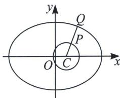

<!-- question-source:start -->
例4 (2023·河南模拟)设 $P, Q$ 分别为圆 $(x - 1)^{2} + y^{2} = 2$ 和椭圆 $\frac{x^{2}}{25} + \frac{y^{2}}{16} = 1$ 上的点, 则 $P, Q$ 两点间的最短距离是 ( ) A. $\sqrt{2}$ B. $\frac{5\sqrt{2}}{3}$ C. $\frac{8\sqrt{2}}{3}$ D. $\frac{11\sqrt{2}}{3}$

<!-- question-source:end -->

![[高中/总复习/专题/2026版高中《mst老唐说题》圆锥曲线专题（数学）/上册/第08章_联立计算高阶篇/第二节_单动点与圆锥曲线参数方程/二_单动点三角换元解决二次曲线上的距离问题/例题/answers/Q00048686A1.md]]
