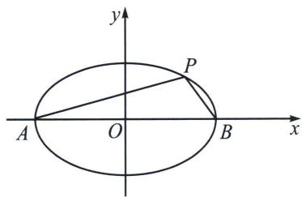
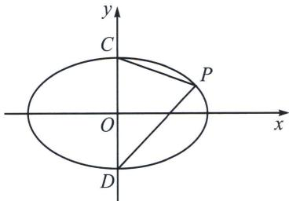

## 五、万能三角代换与顶点弦速解

椭圆： $\left\{ \begin{array}{l}x = a\cos \theta \\ y = b\sin \theta \end{array} \right.$ ，双曲线： $\left\{ \begin{array}{l}x_{1} = \frac{a}{\cos\theta}\\ y_{1} = b\tan \theta \end{array} \right.$ ，不妨令 $t = \tan \frac{\theta}{2}$

通常单个动点在圆锥曲线上，用参数换元连接四个顶点是能大大简化计算的。以椭圆为例，

$$
k _ {P A} = \frac {b \sin \theta}{a \cos \theta + a} = \frac {b}{a} \frac {2 \sin \frac {\theta}{2} \cos \frac {\theta}{2}}{2 \cos^ {2} \frac {\theta}{2}} = \frac {b}{a} \tan \frac {\theta}{2} = \frac {b}{a} t, k _ {P B} = \frac {b \sin \theta}{a \cos \theta - a} = - \frac {b}{a} \frac {2 \sin \frac {\theta}{2} \cos \frac {\theta}{2}}{2 \sin^ {2} \frac {\theta}{2}} = - \frac {b}{a \tan \frac {\theta}{2}} = - \frac {b}{a t},
$$

计算量瞬间被简化. 同理, 关于上下顶点, $k_{PC} = -\frac{b(1 - \sin\theta)}{a\cos\theta} = -\frac{b\left(\sin\frac{\theta}{2} - \cos\frac{\theta}{2}\right)^2}{a\left(\cos^2\frac{\theta}{2} - \sin^2\frac{\theta}{2}\right)} = -\frac{b(1 - t)}{a(1 + t)}, k_{PD}$

$$
= \frac {b (1 + t)}{a (1 - t)}
$$

记忆方法：将 $t = \tan \frac{\theta}{2}$ 作为第一象限角，则 $0 < t < 1$ ，显然 $|k_{PA}| < |k_{PB}|$ ，所以左乘右除，左正右负， $k_{PA} = \frac{b}{a} t, k_{PB} = -\frac{b}{at}; |k_{PC}| < |k_{PD}|$ 上负下正，上小下大， $k_{PC} = -\frac{b(1 - t)}{a(1 + t)}, k_{PD} = \frac{b(1 + t)}{a(1 - t)};$

同理，双曲线 $k_{PA} = \frac{b\tan\theta}{\frac{a}{\cos\theta} + a} = \frac{b}{a}\frac{2\sin\frac{\theta}{2}\cos\frac{\theta}{2}}{2\cos^2\frac{\theta}{2}} = \frac{b}{a}\tan \frac{\theta}{2} = \frac{b}{a} t,$ $k_{PB} = \frac{b\tan\theta}{\frac{a}{\cos\theta} - a} = \frac{b}{at}.$

例(2013·江西文)椭圆 $C: \frac{x^{2}}{a^{2}} + \frac{y^{2}}{b^{2}} = 1 (a > b > 0)$ 的离心率为 $e = \frac{\sqrt{3}}{2}, a + b = 3$ .

(1)求椭圆 C 的方程;

(2)如图, $A, B, D$ 是椭圆 $C$ 的顶点, $P$ 是椭圆 $C$ 上除顶点外的任意点, 直线 $DP$ 交 $x$ 轴于 $N$ 直线 $AD$ 交 $BP$ 于点 $M$ , 设 $BP$ 的斜率为 $k$ , $MN$ 的斜率为 $m$ , 证明为 $2m - k$ 为定值.

(2)设点 $P(2\cos \theta ,\sin \theta)(\theta \in \left(0,\frac{\pi}{2}\right))$ 则有 $\left\{ \begin{array}{l}x = 2\cos \theta = 2\frac{1 - t^2}{1 + t^2}\\ y = \sin \theta = \frac{2t}{1 + t^2} \end{array} \right.$ （其中 $t = \tan \frac{\theta}{2}$ ） $l_{PB}:y = -\frac{1}{2t} (x - 2),l_{PD}:y = -\frac{1 - t}{2(t + 1)} x + 1$ ，由题可知 $l_{AD}:y = \frac{1}{2} x + 1$ ；联立直线 $AD$ 和直线 $PB$ 可得： $M\left(\frac{2(1 - t)}{1 + t},\frac{2}{1 + t}\right)$ ；联立直线 $PD$ 和直线 $y = 0$ 可得： $N\left(\frac{2(t + 1)}{1 - t},0\right)$ ；所以 $k_{MN} = \frac{0 - \frac{2}{1 + t}}{\frac{2(t + 1)}{1 - t} - \frac{2(1 - t)}{t + 1}} =$ $-\frac{1 - t}{4t}$ ，所以 $2m - k = \frac{1}{2}$

![[高中/总复习/专题/2026版高中《mst老唐说题》圆锥曲线专题（数学）/上册/第08章_联立计算高阶篇/第二节_单动点与圆锥曲线参数方程/五_万能三角代换与顶点弦速解/例题/Q00053077.md]]
