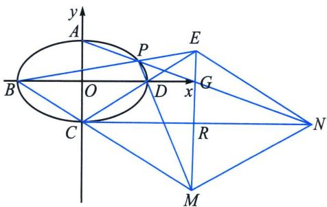

> [!faq]- 《圆锥曲线专题(上册)》例题解析
>
> > [!success]- **【答案】** 详见解析
>
> > [!note]- **【解析】**
> > 解析 (1)椭圆 $E$ 的方程为 $\frac{x^2}{9} +\frac{y^2}{4} = 1.$
> >
> > 
> >
> > (2)设点 $P(3\cos \theta, 2\sin \theta)\left(\theta \in \left(0, \frac{\pi}{2}\right)\right)$ , 则令 $t = \tan \frac{\theta}{2}$ , $k_{PA} = \frac{2\sin \theta - 2}{3\cos \theta} = -\frac{2}{3} \cdot \frac{\left(\sin \frac{\theta}{2} - \cos \frac{\theta}{2}\right)^2}{\cos^2 \frac{\theta}{2} - \sin^2 \frac{\theta}{2}} = -\frac{2(1 - t)}{3(1 + t)}$ , $l_{PA}: y = \frac{2(t - 1)}{3(t + 1)}x + 2$ , 联立直线 $PA$ 和直线 $y = -2$ 可得: $N\left(\frac{-6(t + 1)}{t - 1}, -2\right)$ ; $k_{PD} = \frac{2\sin \theta}{3\cos \theta - 3} = -\frac{2}{3} \cdot \frac{2\sin \frac{\theta}{2}\cos \frac{\theta}{2}}{2\sin^2 \frac{\theta}{2}} = -\frac{2}{3t}$ , 由题可知 $l_{BC}: y = -\frac{2}{3}x - 2$ ; $l_{PD}: y = -\frac{2}{3t}(x - 3)$ , 联立直线 $PD$ 和直线 $BC$ 可得: $M\left(\frac{3(1 + t)}{1 - t}, \frac{-4}{1 - t}\right)$ ; 所以 $k_{MN} = \frac{-2 - \frac{4}{t - 1}}{\frac{-6(t + 1)}{t - 1} + \frac{3(1 + t)}{t - 1}} = \frac{2}{3}$ , 所以 $k_{CD} = \frac{2}{3} = k_{MN} \Rightarrow MN // CD$ , 得证!
> >
> > 注意 更多利用三角换元，涉及双动点的，请大家参考《对合方程》篇.
