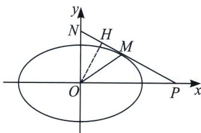

<!-- question-source:start -->
例10（2022·天津卷）椭圆 $\frac{x^{2}}{a^{2}}+\frac{y^{2}}{b^{2}}=1(a>b>0)$ 离心率为 $\frac{\sqrt{6}}{3}$ ，直线l与椭圆有唯一公共点M，与y轴交于点N(N异于M)，记O为原点，若 $|OM|=|ON|$ ，且 $\triangle OMN$ 面积为 $\sqrt{3}$ ，求椭圆方程.

<!-- question-source:end -->

![[高中/总复习/专题/2026版高中《mst老唐说题》圆锥曲线专题（数学）/上册/第08章_联立计算高阶篇/第二节_单动点与圆锥曲线参数方程/四_三角换元破解切线单动点/例题/answers/Q00048694A1.md]]
