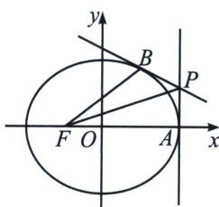

> [!faq]- 《圆锥曲线专题(上册)》例题解析
>
> > [!success]- **【答案】** 详见解析
>
> > [!note]- **【解析】**
> > 解析 (1)依题意, 设椭圆 $\frac{x^{2}}{a^{2}} + \frac{y^{2}}{b^{2}} = 1 (a > b > 0)$ 的半焦距为 $c$ , 则左焦点 $F(-c, 0)$ , 右顶点 $A(a, 0)$ , 离心率 $e = \frac{c}{a} = \frac{1}{2}$ , 即 $a = 2c$ , 因为 $P$ 为 $x = a$ 上一点, 设 $P(a, m)$ , 又直线 $PF$ 的斜率为 $\frac{1}{3}$ , 则 $\frac{m - 0}{a - (-c)} = \frac{1}{3}$ , 即 $\frac{m}{a + c} = \frac{1}{3}$ , 所以 $\frac{m}{2c + c} = \frac{1}{3}$ , 解得 $m = c$ , 则 $P(a, c)$ , 即 $P(2c, c)$ , 因为 $\triangle PFA$ 的面积为 $\frac{3}{2}$ , $|AF| = a - (-c) = a + c = 3c$ , 高为 $|m| = c$ , 所以 $S_{\triangle PFA} = \frac{1}{2} |AF| |m| = \frac{1}{2} \times 3c \times c = \frac{3}{2}$ , 解得 $c = 1$ , 则 $a = 2c = 2$ , $b^{2} = a^{2} - c^{2} = 3$ , 所以椭圆的方程为 $\frac{x^{2}}{4} + \frac{y^{2}}{3} = 1$ .
> >
> > 
> >
> > (2)由(1)可知 $P(2, 1)$ , $F(-1, 0)$ , $A(2, 0)$ , 易知直线 $PB$ 的斜率存在, 设其方程为 $y = kx + m$ , 则 $1 = 2k + m$ , 即 $m = 1 - 2k$ , 联立 $\left\{ \begin{array}{l} y = kx + m \\ \frac{x^2}{4} + \frac{y^2}{3} = 1 \end{array} \right.$ , 消去 $y$ 得, $(3 + 4k^2)x^2 + 8kmx + 4m^2 - 12 = 0$ , 因为直线与椭圆有唯一交点，所以 $\Delta = (8k\cdot m)^2 -4(3 + 4k^2)\cdot (4m^2 -12) = 0$ ，即 $4k^{2} - m^{2} + 3 = 0$ ，则 $4k^{2} - (1 - 2k)^{2} + 3 =$ 0，解得 $k = -\frac{1}{2}$ ，则 $m = 2$ ，所以直线 $PB$ 的方程为 $y = -\frac{1}{2} x + 2$ ，联立 $\left\{ \begin{array}{l}y = -\frac{1}{2} x + 2\\ \frac{x^2}{4} +\frac{y^2}{3} = 1 \end{array} \right.$ ，解得 $\left\{ \begin{array}{l}x = 1\\ y = \frac{3}{2} \end{array} \right.$ 则 $B\left(1,\frac{3}{2}\right)$ ，所以 $k_{FB} = \frac{\frac{3}{2} - 0}{1 - (-1)} = \frac{3}{4}, k_{PF} = \frac{1 - 0}{2 - (-1)} = \frac{1}{3}, k_{AF} = 0$ ，由两直线夹角公式，得 $\tan \angle BFP =$ $\left|\frac{\frac{3}{4} - \frac{1}{3}}{1 + \frac{1}{3}\times\frac{3}{4}}\right| = \frac{1}{3},\tan \angle PFA = \left|\frac{\frac{1}{3} - 0}{1 + 0}\right| = \frac{1}{3}$ ，则 $\tan \angle BFP = \tan \angle PFA$ ，又∠BFP，∠PFA∈（0，π/2），所以∠BFP=∠PFA，即PF平分∠AFB.
> >
> > 注意 本题由于什么数据都给予了，没什么计算难度，天津卷一直重导数，轻圆锥，我们看实都能推导一般性结论，设 $B(a\cos \theta, b\sin \theta)$ ，则 $PB: \frac{x\cos \theta}{a} + \frac{y\sin \theta}{b} = 1$ ，当 $x = a$ 时， $y_P = \frac{b(1 - \cos \theta)}{\sin \theta} = b\tan \frac{\theta}{2}$ ，所以 $\tan \alpha = \tan \angle PFA = \frac{b\tan \frac{\theta}{2}}{a + c}$ ， $\tan \beta = \tan \angle BFA = \frac{b\sin \theta}{a\cos \theta + c} = \frac{\frac{2b\tan \frac{\theta}{2}}{1 + \tan^2 \frac{\theta}{2}}}{\frac{a(1 - \tan^2 \frac{\theta}{2})}{1 + \tan^2 \frac{\theta}{2}} + c} = \frac{2b\tan \frac{\theta}{2}}{a + c - (a - c)\tan^2 \frac{\theta}{2}}$ ，由于 $b^2 = (a + c)(a - c)$ ，故 $\tan 2\alpha = \frac{\frac{2b\tan \frac{\theta}{2}}{a + c}}{1 - \left(\frac{b\tan \frac{\theta}{2}}{a + c}\right)^2} = \frac{2b\tan \frac{\theta}{2}}{(a + c) - \frac{b^2}{a + c}\tan^2 \frac{\theta}{2}} = \frac{2b\tan \frac{\theta}{2}}{(a + c) - (a - c)\tan^2 \frac{\theta}{2}}$ ，所以本题是一个恒成立的问题，即 $P$ 为椭圆右顶点处切线与任意一点处切线的交点，则一定有 $PF$ 平分 $\angle AFB$ 。
