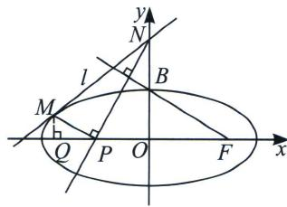

> [!faq]- 《圆锥曲线专题(上册)》例题解析
>
> > [!success]- **【答案】** 详见解析
>
> > [!note]- **【解析】**
> > 解析 (1)由题意知 $B(0, b)$ , $F(c, 0)$ , 所以 $|BF| = \sqrt{c^2 + b^2} = a = 2\sqrt{5}$ , $e = \frac{c}{a} = \frac{2\sqrt{5}}{5}$ , 所以 $c = 4$ , $b^2 = a^2 - c^2 = 20 - 16 = 4$ , 因此椭圆方程为: $\frac{x^2}{20} + \frac{y^2}{4} = 1$ .
> >
> > 
> >
> > $M$ 点在椭圆上，由于 $M$ 在第二象限，故 $y = 2\sqrt{1 - \frac{x^2}{20}}$ ，求导得 $k = y' = \frac{-\frac{2x}{20}}{\sqrt{1 - \frac{x^2}{20}}} = -\frac{x}{10} \cdot \frac{1}{\sqrt{1 - \frac{x^2}{20}}}$
> >
> > 当 $x = x_{M}$ 时， $\sqrt{1 - \frac{x_M^2}{20}} = \frac{y_M}{2}$ ，故 $k = -\frac{x_M}{5y_M}$ ，代入切线方程 $y - y_{M} = k(x - x_{M})$ 得： $\frac{xx_M}{20} +\frac{yy_M}{4} = 1,$
> >
> > 设 $M(2\sqrt{5}\cos\theta, 2\sin\theta)$ ，直线 $l_{MN}:\frac{2\sqrt{5}\cos\theta\cdot x}{20}+\frac{2\sin\theta\cdot y}{4}=1$ ，令 x=0 得 $y_{N}=\frac{2}{\sin\theta}$ ，所以 $N\left(0,\frac{2}{\sin\theta}\right)$ ，过 M 作 MQ 垂直于 x 轴，垂足为 Q，因为 $MP\perp PN$ ，所以 $\angle BFP=\angle PNO=\angle MPQ$ ，由于 $|OF|=2|OB|$ ，
> >
> > $$
> > \mid Q P \mid = 2 \mid M Q \mid , \mid O N \mid = 2 \mid O P \mid , \mid O Q \mid = \mid O P \mid + \mid P Q \mid = \frac {1}{2} \mid O N \mid + 2 \mid M Q \mid
> > $$
> >
> > $$
> > - 2 \sqrt {5} \cos \theta = 4 \sin \theta + \frac {1}{\sin \theta}, \theta \in [ 0, 2 \pi)
> > $$
> >
> > $$
> > \sin \theta \neq 0, \cos \theta \neq 0
> > $$
> >
> > $$
> > 4 \sin^ {2} \theta + 1 + 2 \sqrt {5} \sin \theta \cos \theta = 0
> > $$
> >
> > $$
> > 5 \sin^ {2} \theta + 2 \sqrt {5} \sin \theta \cos \theta + \cos^ {2} \theta = 0
> > $$
> >
> > $$
> > \cos^ {2} \theta
> > $$
> >
> > $$
> > 5 \tan^ {2} \theta + 2 \sqrt {5} \tan \theta + 1 = 0
> > $$
> >
> > $$
> > \tan \theta = - \frac {1}{\sqrt {5}}
> > $$
> >
> > 由 $\left\{ \begin{array}{l} \sin^2\theta + \cos^2\theta = 1 \\ \tan \theta = \frac{\sin\theta}{\cos\theta} \end{array} \right.$ ，解得 $\left\{ \begin{array}{l} \sin \theta = \frac{1}{\sqrt{6}} \\ \cos \theta = -\frac{\sqrt{5}}{\sqrt{6}} \end{array} \right.$ 或者 $\left\{ \begin{array}{l} \sin \theta = -\frac{1}{\sqrt{6}} \\ \cos \theta = \frac{\sqrt{5}}{\sqrt{6}} \end{array} \right.$ （舍去）．代入 $l_{MN}: \frac{2\sqrt{5}\cos\theta \cdot x}{20} + \frac{2\sin\theta \cdot y}{4} = 1$
> >
> > $$
> > l _ {M N}
> > $$
> >
> > $$
> > x - y + 2 \sqrt {6} = 0
> > $$
