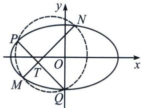
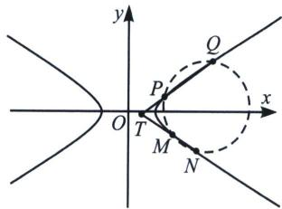

## 一、四点共圆曲线系原理

圆锥曲线上的四点共圆问题: 圆锥曲线 $f_{1}(x, y) = Ax^{2} + By^{2} + Dx + Ey + F = 0$ 上存在四点 $P 、 Q 、 M 、 N$ , 且 $PQ$ 与 $MN$ 相交于点 $T$ , 若满足 $|TM| \cdot |TN| = |TP| \cdot |TQ|$ , 则 $P 、 Q 、 M 、 N$ 四点共圆 (如图). 根据初中的相交弦定理 (左图) 或切割线定理 (右图) 即可证明, 当然也有同学觉得需要更严谨的证明, 不妨利用相似来证明.

我们来理解四点共圆的曲线系方程形式，其实本质就是四点整体联立的思想，曲线系就是不同曲线交点构造新的曲线的方程，四点共圆，由于是 $f_{1}(x, y) = Ax^{2} + By^{2} + Dx + Ey + F = 0$ 上四点形成的圆，不妨设 $l_{MN}: k_{1}x - y + m_{1} = 0, l_{PQ}: k_{2}x - y + m_{2} = 0$ ，而 $f_{2}(x, y) = (k_{1}x - y + m_{1}) \cdot (k_{2}x - y + m_{2}) = 0$ 表示满足直线 $MN$ 和直线 $PQ$ 上的任意点方程，属于两条直线并集， $f_{1}(x, y) + \lambda f_{2}(x, y) = 0$ 表示过圆锥曲线和两直线构成的退化二次曲线交点的一系列曲线方程，有一个满足圆的方程 $f_{3}(x, y) = x^{2} + y^{2} + D_{1}x + E_{1}y + F_{1} = 0$ ，即

$$
A x ^ {2} + B y ^ {2} + D x + E y + F + \lambda \left(k _ {1} x - y + m _ {1}\right) \left(k _ {2} x - y + m _ {2}\right) = \mu \left(x ^ {2} + y ^ {2} + D _ {1} x + E _ {1} y + F _ {1}\right).
$$

由于没有 $xy$ 的项，必有 $-k_{1} - k_{2} = 0$ 。即 $PQ$ 与 $MN$ 斜率互为相反数。

证明四点共圆的步骤：

1. 设出曲线系方程，解出 $\lambda$ ;

2. 根据 $4R^{2} = D^{2} + E^{2} - 4F > 0$ 证明四点一定共圆.

![[高中/总复习/专题/2026版高中《mst老唐说题》圆锥曲线专题（数学）/上册/第08章_联立计算高阶篇/第五节_二次曲线系与四点共圆/一_四点共圆曲线系原理/例题/Q00048719.md]]
