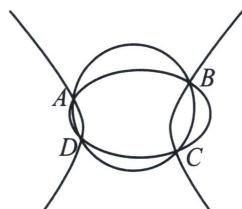
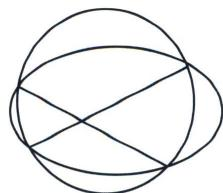

## 三、四点共圆的充要条件与数据

四点共圆总定理：一个二次曲线 $Ax^{2} + By^{2} + Dx + Ey + F = 0$ 上四点，其中包含四点的任意两条退化的二次曲线斜率和为零，则这四点共圆.

若曲线 $Ax^{2}+By^{2}+Dx+Ey+F=0$ 与 $l_{1}: y=k_{1}x+m_{1}$ 与 $l_{2}: y=k_{2}x+m_{2}$ 有四个交点 A、B、C、D，则点共圆的充要条件是 $k_{1}+k_{2}=0$ .

注意： $l_{1}$ ： $y=k_{1}x+m_{1}$ 与 $l_{2}$ ： $y=k_{2}x+m_{2}$ 可以表示为 AB 与 CD，也可以表示为 AC 与 BD，也可以表示为 AD 与 BC，因为曲线系就是以这四点形成的退化二次曲线方程，那么包含这四点的退化二次曲线方程就

包含这三种情况，由于交叉项不存在，所以 $k_{1} + k_{2} = 0$ .

证明：由四点共圆总定理可知，两直线形成退化二次曲线的 $(k_{1}x-y+m_{1})(k_{2}x-y+m_{2})=0$ ，此时交叉项xy为0，故它们的交点共圆．本定理也可以理解为两直线形成的退化二次曲线的对称轴也是x轴与y轴的平行线，所以满足拥有两平行的对称轴的曲线系共圆.

推论：若圆锥曲线 $f_{1}(x, y)=Ax^{2}+By^{2}+Dx+Ey+F=0$ 上存在四点 P、Q、M、N，斜率互为相反数，且 PQ 是 MN 中垂线，则 $k_{MN}=\pm1$ ;

![[高中/总复习/专题/2026版高中《mst老唐说题》圆锥曲线专题（数学）/上册/第08章_联立计算高阶篇/第五节_二次曲线系与四点共圆/三_四点共圆的充要条件与数据/例题/Q00048721.md]]
![[高中/总复习/专题/2026版高中《mst老唐说题》圆锥曲线专题（数学）/上册/第08章_联立计算高阶篇/第五节_二次曲线系与四点共圆/三_四点共圆的充要条件与数据/例题/Q00053089.md]]
