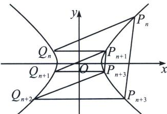
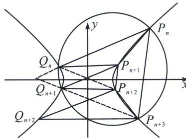

> [!faq]- 《圆锥曲线专题(上册)》例题解析
>
> > [!success]- **【答案】** 详见解析
>
> > [!note]- **【解析】**
> > 解析 (1)(2)略(参考本章第三节例12)
> >
> > 
> >
> > 
> >
> > (3)要证 $S_{n} = S_{n + 1}$ ，只需证 $P_{n + 1}P_{n + 2} / / P_nP_{n + 3}$ ，由于 $Q_{n}P_{n + 1}P_{n + 2}Q_{n + 1}$ 为等腰梯形， $k_{Q_nQ_{n + 1}} + k_{P_{n + 1}P_{n + 2}} = 0$ 故 $Q_{n}$ 、 $P_{n + 1}$ 、 $P_{n + 2}$ 、 $Q_{n + 1}$ 四点共圆，则 $k_{P_{n + 1}Q_{n + 1}} + k_{P_{n + 2}Q_n} = 0$
> >
> > 同理 $Q_{n + 1}$ 、 $P_{n + 2}$ 、 $P_{n + 3}$ 、 $Q_{n + 2}$ 四点共圆， $k_{P_{n + 3}Q_{n + 1}} + k_{P_{n + 2}Q_{n + 2}} = 0,$
> >
> > 由于 $P_{n}Q_{n} / / P_{n + 1}Q_{n + 1} / / P_{n + 2}Q_{n + 2}$ ，故 $k_{P_{n + 3}Q_{n + 1}} + k_{P_nQ_n} = 0$ ，所以 $Q_{n}$ 、 $Q_{n + 1}$ 、 $P_{n}$ 、 $P_{n + 3}$ 四点共圆，证明如下：
> >
> > $P_{n}Q_{n}: y=kx+m_{1}; P_{n+3}Q_{n+1}: y=-kx+m_{2}$ ，以 $Q_{n}$ 、 $Q_{n+1}$ 、 $P_{n}$ 、 $P_{n+3}$ 构成的曲线系方程为： $x^{2}-y^{2}-9+\lambda(kx-y+m_{1})(kx+y-m_{2})=\mu(x^{2}+y^{2}+Dx+Ey+F)$ ，由于 xy 系数为 0，故 $Q_{n}$ 、 $Q_{n+1}$ 、 $P_{n}$ 、 $P_{n+3}$ 四点共圆， $Q_{n}Q_{n+1}: y=k_{1}x+m_{3}; P_{n}P_{n+3}: y=k_{2}x+m_{4}$ ，则这四点的曲线系方程也可以表示为
> >
> > $x^{2} - y^{2} - 9 + \lambda_{1}(k_{1}x - y + m_{3})(k_{2}x - y + m_{4}) = \mu_{1}(x^{2} + y^{2} + Dx + Ey + F)$ ，由于 $xy$ 系数为0，则 $k_{1} + k_{2} = 0$ ， $k_{P_nP_{n + 3}} + k_{Q_{n + 1}Q_n} = 0$ ，即证明 $P_{n + 1}P_{n + 2} / / P_nP_{n + 3}$
