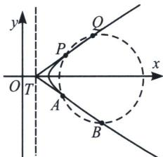

> [!faq]- 《圆锥曲线专题(上册)》例题解析
>
> > [!success]- **【答案】** 详见解析
>
> > [!note]- **【解析】**
> > 解析 (1) 因为 $|MF_1| - |MF_2| = 2$ 所以轨迹 $C$ 为双曲线右半支, $c^2 = 17$ , $2a = 2$ , 所以 $a^2 = 1$ , $b^2 = 16$ , 299 老唐说题
> >
> > 所以 $x^{2}-\frac{y^{2}}{16}=1(x>0)$ .
> >
> > (2)
> > 解法一：（韦达联立硬算）设 $T\left(\frac{1}{2}, n\right)$ ，设 $AB: y - n = k_1\left(x - \frac{1}{2}\right)$ ，联立 $\left\{ \begin{array}{l} y - n = k_1\left(x - \frac{1}{2}\right) \\ x^2 - \frac{y^2}{16} = 1 \end{array} \right.$ ，所以 $(16 - k_1^2)x^2 + (k_1^2 - 2k_1n)x - \frac{1}{4}k_1^2 - n^2 + k_1n - 16 = 0$ ，得 $x_1 + x_2 = \frac{k_1^2 - 2k_1n}{k_1^2 - 16}$ ， $x_1x_2 = \frac{\frac{1}{4}k_1^2 + n^2 - k_1n + 16}{k_1^2 - 16}$ ， $|TA| = \sqrt{1 + k_1^2}\left(x_1 - \frac{1}{2}\right)$ ， $|TB| = \sqrt{1 + k_1^2}\left(x_2 - \frac{1}{2}\right)$ ，所以 $|TA| \cdot |TB| = (1 + k_1^2)\left(x_1 - \frac{1}{2}\right)\left(x_2 - \frac{1}{2}\right) = \frac{(n^2 + 12)(1 + k_1^2)}{k_1^2 - 16}$ ，设 $PQ: y - n = k_2\left(x - \frac{1}{2}\right)$ ，同理 $|TP| \cdot |TQ| = \frac{(n^2 + 12)(1 + k_2^2)}{k_2^2 - 16}$ ，因为 $|TA| \cdot |TB| = |TP| \cdot |TQ|$ ，所以 $\frac{1 + k_1^2}{k_1^2 - 16} = \frac{1 + k_2^2}{k_2^2 - 16}$ ， $1 + \frac{17}{k_1^2 - 16} = 1 + \frac{17}{k_2^2 - 16}$ ，所以 $k_1^2 - 16 = k_2^2 - 16$ ，即 $k_1^2 = k_2^2$ ，因为 $k_1 \neq k_2$ ，所以 $k_1 + k_2 = 0$ 。
> >
> > 
> >
> > 解法二：令 $AB: y - n = k_{1}\left(x - \frac{1}{2}\right)$ ， $PQ: y - n = k_{2}\left(x - \frac{1}{2}\right)$ ，因为 $|AT| \cdot |TB| = |PT| \cdot |TQ|$ ，所以 $A, P, Q, B$ 四点共圆，以 $AB$ ， $PQ$ 构成的弱化二次曲线方程为： $\left(k_{1}x - y - \frac{1}{2}k_{1} + n\right)\left(k_{2}x - y - \frac{1}{2}k_{2} + n\right) = 0$ ，则以 $AB$ ， $PQ$ 与双曲线 $x^{2} - \frac{y^{2}}{16} - 1 = 0$ 构成的圆系方程为： $x^{2} - \frac{y^{2}}{16} - 1 + \lambda\left(k_{1}x - y - \frac{1}{2}k_{1} + n\right)\left(k_{2}x - y - \frac{1}{2}k_{2} + n\right) = \mu\left(x^{2} + y^{2} + Dx + Ey + F\right)$ ， $xy$ 系数为 0，所以 $\lambda(-k_{1} - k_{2}) = 0$ ，所以 $k_{1} + k_{2} = 0$ 。
