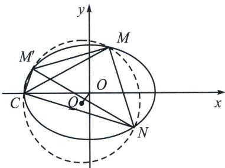
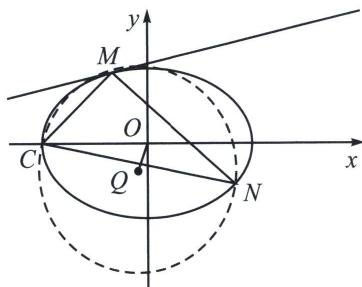

<!-- question-source:start -->
例5 (2025届T8联考T18)已知过 $A(-1,0)$ , $B(1,0)$ 两点的动抛物线的准线始终与圆 $x^{2}+y^{2}=9$ 相切, 该抛物线焦点 $P$ 的轨迹是某圆锥曲线 $E$ 的一部分.

(1)求曲线 E 的标准方程;

(2)已知点 $C(-3,0)$ , $D(2,0)$ , 过点 $D$ 的动直线与曲线 $E$ 交于 $M$ , $N$ 两点, 设 $\triangle CMN$ 的外心为 $Q$ , $O$ 为坐标原点, 问: 直线 $OQ$ 与直线 $MN$ 的斜率之积是否为定值, 如果是定值, 求出该定值; 如果不是定值,说明理由.

(1)由题意知抛物线的焦点 $P$ 到两定点 $A, B$ 的距离之和等于点 $A, B$ 到抛物线的准线的距离之和, 等于 $AB$ 的中点 $O$ 到准线的距离的 2 倍, 即等于圆 $x^{2} + y^{2} = 9$ 的半径的 2 倍, 所以 $|PA| + |PB| = 6 > |AB| = 2$ , 所以点 $P$ 在以 $A, B$ 为焦点的椭圆 $E$ 上, 设椭圆 $E$ 的标准方程为 $\frac{x^{2}}{a^{2}} + \frac{y^{2}}{b^{2}} = 1 (a > b > 0)$ , 所以 $a =$

3, $c = 1$ ，所以 $b^{2} = a^{2} - c^{2} = 8$ ，所以曲线 $E$ 的标准方程为 $\frac{x^2}{9} +\frac{y^2}{8} = 1$

(2)解法一(三点转四点共圆): 如左图, 若 $\triangle MCN$ 为椭圆 $E$ 与其外接圆的内接三角形, 则椭圆 $E$ 和外接圆还会存在第四个交点 $M'$ , 如右图, 若 $M$ 为 $\triangle MCN$ 外接圆与椭圆的公切点, 此时为退化的四点, $M$ 与 $M'$ 重合, 设 $\left. \begin{array}{l} CM': x = ty - 3 \\ MN: x = \frac{1}{k}y + 2 \end{array} \right\}$ , 由于四点共圆, 所以以 $C, M, N, M'$ 四点的曲线系方程为:

$$
(x - t y + 3) \left(x - \frac {1}{k} y - 2\right) + \lambda \left(\frac {x ^ {2}}{9} + \frac {y ^ {2}}{8} - 1\right) = \mu \left(x ^ {2} + y ^ {2} + D x + E y + F\right)
$$

$$
k = - \frac {1}{t}
$$

曲线系方程变为： $(x - ty + 3)(x + ty - 2) + \lambda \left(\frac{x^2}{9} +\frac{y^2}{8} -1\right) = \mu (x^2 +y^2 +Dx + Ey + F)$ ，由于 $Q\left(-\frac{D}{2},$ $-\frac{E}{2}\right)$ ，且 $x$ 系数： $\mu D = -2 + 3 = 1$ ， $y$ 系数： $\mu E = 3t + 2t = 5t$ ，所以 $k_{\mathrm{OQ}}\cdot k_{\mathrm{MN}} = \frac{E}{D}\cdot \left(-\frac{1}{t}\right) = -5$ 。

(1)

联立椭圆 E 与直线 $MN\left\{\begin{aligned}x&=ty+2\\ 8 &x^{2}+9 &y^{2}=72\end{aligned}\right.$ 得： $(8t^{2}+9)y^{2}+32ty-40=0$
(2)

方程
(1)
(2)为同解方程，因此对应系数成比例，则 $\frac{t^2 + 1}{8t^2 + 9} = \frac{4t - 2tm - 2n}{32t} = \frac{-5 - 10m}{-40}$

由后面两等式可得 $\frac{n}{m} = -5t$ ，所以 $k_{OQ}\cdot k_{MN} = -5t\cdot \frac{1}{t} = -5$
<!-- question-source:end -->

![[高中/总复习/专题/2026版高中《mst老唐说题》圆锥曲线专题（数学）/上册/第08章_联立计算高阶篇/第五节_二次曲线系与四点共圆/四_外接圆与隐藏第四点的四点共圆/例题/answers/Q00048723A1.md]]
