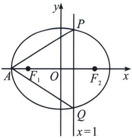
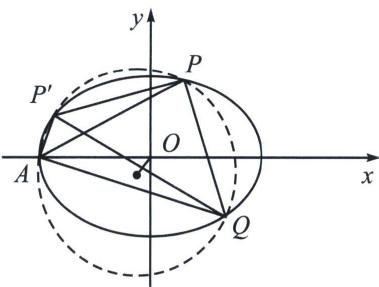

<!-- question-source:start -->
例6（福建名校联盟全国优质校 2025 届高三大联考 18 题）已知椭圆 $C: \frac{x^{2}}{9} + \frac{y^{2}}{3} = 1$ 的左顶点为 $A$ ，过点 (1, 0) 的直线 $l$ 交 $C$ 于 $P, Q$ 两点，记 $\triangle APQ$ 的外接圆为圆 $N$ .
(1) 当 $l$ 与 $x$ 轴垂直时，求圆 $N$ 的方程；
(2) 求圆 $N$ 面积的最大值.

(1)当直线 $l$ 与 $x$ 轴垂直时, 联立直线 $x = 1$ 与 $C$ 的方程, 即 $\left\{ \begin{array}{l} x = 1 \\ \frac{x^2}{9} + \frac{y^2}{3} = 1 \end{array} \right.$ , 解得 $y^2 = \frac{8}{3}$ , 不妨设 $P\left(1, \frac{2\sqrt{6}}{3}\right)$ , $Q\left(1, -\frac{2\sqrt{6}}{3}\right)$ . 圆心 $N$ 在 $x$ 轴上, $A(-3,0)$ , 设 $N(t,0)$ , 所以 $\triangle APQ$ 的外接圆半径 $R = |AN| = |PN|$ . 所以 $t + 3 = \sqrt{(t - 1)^2 + \left(\frac{2\sqrt{6}}{3}\right)^2}$ , 解得 $t = -\frac{2}{3}$ , 所以 $R = \frac{7}{3}$ , 所以圆 $N$ 的方程为 $\left(x + \frac{2}{3}\right)^2 + y^2 = \frac{49}{9}$ .

<!-- source-part:5 pages:321-358 -->

(2)在椭圆上取一个点, 根据圆与椭圆交点, 必有四个 (相切才为三个以内), 所以 $APQ$ 的外接圆则为 $APP'Q$ 四点的外接圆

$AP^{\prime}: x = ty - 3$ 四点共圆，所以以 $A, P, Q, P'$ 四点形式曲线系方程为： $PQ: x = t'y + 1$

$(x-ty+3)(x-t'y-1)+\lambda\left(\frac{x^{2}}{9}+\frac{y^{2}}{3}-1\right)=\mu(x^{2}+y^{2}+Dx+Ey+F)$ ，由于无xy项，故 $t'=-t$ ，故曲线系方程为： $(x-ty+3)(x+ty-1)+\lambda\left(\frac{x^{2}}{9}+\frac{y^{2}}{3}-1\right)=\mu(x^{2}+y^{2}+Dx+Ey+F)$ ，由于 $R=\frac{1}{2}\sqrt{D^{2}+E^{2}-4F}$ ，x系数： $\mu D=-1+3=2$ ，y系数： $\mu E=t+3t=4t$ ，常数项： $\mu F=-3-\lambda$ ， $x^{2}$ 与 $y^{2}$ 系数相等： $\mu=1+\frac{\lambda}{9}=-t^{2}+\frac{\lambda}{3}$ ，综上

$$
S = \pi R ^ {2} = \frac {\pi}{4} \cdot \left[ \left(\frac {2}{\mu}\right) ^ {2} + \left(\frac {4 t}{\mu}\right) ^ {2} + \frac {4 (3 + \lambda)}{\mu} \right] = \pi \left(\frac {1}{\mu^ {2}} + \frac {- 1 2 + 8 \mu}{\mu^ {2}} + \frac {9 \mu - 6}{\mu}\right) = \pi \frac {9 \mu^ {2} - 2 \mu - 1 1}{\mu^ {2}} \leqslant \frac {1 0 0 \pi}{1 1}.
$$
<!-- question-source:end -->

![[高中/总复习/专题/2026版高中《mst老唐说题》圆锥曲线专题（数学）/上册/第08章_联立计算高阶篇/第五节_二次曲线系与四点共圆/四_外接圆与隐藏第四点的四点共圆/例题/answers/Q00048724A1.md]]
