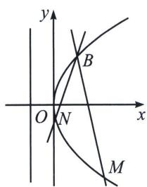
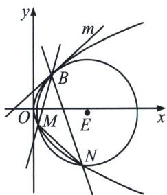

<!-- question-source:start -->
例7 (2025年黑龙江省哈尔滨三中高考数学一模18题(25陪跑课学员胡升辉提问))点 $A$ 为直线 $x = -4$ 上的动点, $O$ 为坐标原点, 过点 $A$ 作直线 $l$ 垂直于 $y$ 轴, 过点 $O$ 作直线 $OA$ 的垂线交直线 $l$ 于点 $P$ .

(1)求点 P 的轨迹方程;

(2)记 $P$ 点轨迹为曲线 $C, C$ 上一定点 $B$ , 过 $B$ 作两不同直线分别交 $C$ 于 $M, N$ 两点,

①直线 BM、BN 的斜率满足 $k_{BM} + k_{BN} = 1$ ，且直线 MN 过点 $(-3, 2)$ ，求定点 B 坐标；

②若点 $B(1,2)$ ，且直线 $BM$ 、 $BN$ 的斜率满足 $k_{BM} + k_{BN} = 0$ ，设 $\triangle BMN$ 的外接圆为圆 $E$ ，过点 $B$ 作曲线 $C$ 的切线 $m$ ，判断直线 $m$ 与圆 $E$ 位置关系，并说明理由.

(1)设 $A(-4, y_0)$ , 那么 $l: y = y_0$ , $OA: y = \frac{y_0}{4} x$ , 当 $y_0 = 0$ 时, $P(0, 0)$ , 当 $y_0 \neq 0$ 时, 直线 $OP: y = -\frac{4}{y_0} x$ , 点 $P$ 的轨迹为 $y^2 = 4x (y \neq 0)$ , 综上所述, 点 $P$ 的轨迹方程 $y^2 = 4x$ ;

(2)如图， $BM:y - y_{B} = \frac{y_{M} - y_{B}}{x_{M} - x_{B}} (x - x_{B})$ ，即 $(y_{B} + y_{M})y = 4x + y_{B}y_{M}$ ，同理， $BN:(y_B + y_N)y = 4x$ $+y_{B}y_{N}$

MN: $(y_{M} + y_{N})y = 4x + y_{M}y_{N}$ , 代入点 $(-3, 2)$ , 所以 $2(y_{M} + y_{N}) = -12 + y_{M}y_{N}$ , 所以 $y_{N} = \frac{12 + 2y_{M}}{y_{M} - 2}$ ①, 又 $k_{BM} + k_{BN} = 1$ , 故 $\frac{4}{y_M + y_B} + \frac{4}{y_N + y_B} = 1$ ②, ②代入①得: $y_{B} = 2$ , 因此 $B(1, 2)$ ;

②法一：如图，当 $y > 0$ 时，根据 $y^{2} = 4x$ ，可得 $y = 2\sqrt{x}$ ，导函数 $y' = \frac{1}{\sqrt{x}}$

当 $x = 1$ 时， $y' = 1$ ，因此切线的斜率为1，因此直线 $m: y = x + 1$ ，设直线 $MN: x = \mu y + n$ ，联立抛物线方程可得 $y^2 - 4\mu y - 4n = 0$ ， $\left\{ \begin{array}{l} \triangle > 0 \\ y_1 + y_2 = 4\mu, k_{BM} + k_{BN} = \frac{4(y_1 + y_2) + 16}{y_1y_2 + 2(y_1 + y_2) + 4} = 0, \\ y_1y_2 = -4n \end{array} \right.$

所以 $y_{1} + y_{2} + 4 = 4\mu +4 = 0$ ，因此 $\mu = -1$ ，BM中垂线： $y - \frac{y_1 + 2}{2} = -\frac{y_1 + 2}{4}\left(x - \frac{y_1^2 + 4}{8}\right)$

同理，BN中垂线： $y - \frac{y_2 + 2}{2} = -\frac{y_2 + 2}{4}\left(x - \frac{y_2^2 + 4}{8}\right)$ ，联立可得 $x = \frac{y_1^2 + y_2^2 + y_1y_2 + 2(y_1 + y_2) + 20}{8} = \frac{n + 7}{2}$ ， $y = \frac{-n - 1}{2}$ ， $k_{BE} \cdot k_m = -1$ ，即直线 $m$ 与圆 $E$ 相切.

(1)知 MN: $x=-y+m$ ，BE: $x-1=t(y-2)$ ，以 M、N、B、E 构造的曲线系方程为： $(x+y-m)(x-ty-1+2t)+\lambda(y^{2}-4x)=\mu(x^{2}+y^{2}+Dx+Ey+F)$ ，由于无 xy 项，故 t=1，故曲线系方程变为： $(x+y-m)(x-y+1)+\lambda(y^{2}-4x)=\mu(x^{2}+y^{2}+Dx+Ey+F)$ ，

所以 $BE: y = x + 1$ ，与直线 $m: y = x + 1$ 重合，即 $B$ 与 $E$ 重合于一点， $B$ 为抛物线和圆公切点，直线 $m$ 与圆 $E$ 相切。
<!-- question-source:end -->

![[高中/总复习/专题/2026版高中《mst老唐说题》圆锥曲线专题（数学）/上册/第08章_联立计算高阶篇/第五节_二次曲线系与四点共圆/四_外接圆与隐藏第四点的四点共圆/例题/answers/Q00048725A1.md]]
