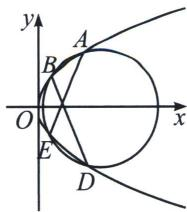

<!-- question-source:start -->
例8 (2025数海二模18题(陪跑课学员潘思宇提问))已知抛物线 $C: y^{2} = 4x$ 的焦点为 $F$ , 过 $y$ 轴上一点 $P$ 作 $C$ 的切线 $PA(A$ 在 $C$ 上, 且异于原点 $O$ ), $PF$ 与 $C$ 交于 $B$ , $D$ 两点.

(1)证明： $PA \perp PF;$

(2)若 $\triangle ABD$ 的外接圆圆心在 $x$ 轴上, 求直线 $BD$ 的方程.

(1)解法一: 易知 $F
(10)$ , 设 $PF: x = my + 1$ , 则 $P \left(0 - \frac{1}{m}\right)$ , 设 $PA: x = k \left(y + \frac{1}{m}\right), y^2 - 4ky - \frac{4k}{m} = 0 \Rightarrow \Delta = 16k^2 + \frac{16k}{m} = 0$ , 故 $k = -\frac{1}{m}, A \left(\frac{1}{m^2} - \frac{2}{m}\right)$ , 则 $k_{PF} \cdot k_{PA} = \frac{1}{m} \cdot \frac{1}{k} = -1$ , 得证!

(2)联立 $PF: x = my + 1$ 与 $y^{2} = 4x$ ，得 $y^{2} - 4my - 4 = 0$

故 $BD$ 中点 $M(2m^2 + 12m)$ ，设 $\triangle ABD$ 的外接圆圆心为 $T$ ，则 $MT: y = -m(x - 2m^2 - 1) + 2m$ ，故 $T(2m^2 + 30)$ 。由 $|AT|^2 = |TB|^2 = |TM|^2 + |MB|^2 = |TM|^2 + \frac{1}{4} |BD|^2$ 得， $\left(2m^2 + 3 - \frac{1}{m^2}\right)^2 + \frac{4}{m^2} = 4 + 4m^2 + \frac{1}{4}(m^2 + 1)|y_B - y_D|^2$ ，

又 $\left\{\begin{aligned}y_{B}+y_{D}&=4m\\ y_{B}y_{D}&=-4\end{aligned}\right.$ ，则 $\left(2m^{2}+3-\frac{1}{m^{2}}\right)^{2}+\frac{4}{m^{2}}=4+4m^{2}+\frac{1}{4}(m^{2}+1)(16m^{2}+16)$ ，

则 $\left(2m^2 + 3 - \frac{1}{m^2}\right)^2 - (2m^2 + 2)^2 = 4 + 4m^2 - \frac{4}{m^2}$ ,

化简得 $(3m^{2} - 1)(m^{2} + 1) = 0$ ，故 $m = \pm \frac{\sqrt{3}}{3}$ ，则 $BD: x = \pm \frac{\sqrt{3}}{3} y + 1.$

(1)令 $A(x_0, y_0)$ ，则 $\left\{ \begin{array}{l} y - y_0 = k(x - x_0) \\ y^2 = 4x \end{array} \right.$ ， $\Delta = 0 \Leftrightarrow k = \frac{2}{y_0}$ ，所以 $PA: yy_0 = 2(x + x_0)$ ，当 $x = 0$ 时， $y_P = \frac{2x_0}{y_0} = \frac{y_0}{2}$ ， $k_{PF} = \frac{\frac{y_0}{2}}{-1} = -\frac{y_0}{2}$ ，所以 $k_{PF} \cdot k = -1$

(2)假设 $\triangle ABD$ 的外接圆经过抛物线的 $E$ 点，由
(1)知 $BD: x=ty+1$ ，此时 $t=\frac{1}{k_{PF}}=-\frac{2}{y_0}$ ，令 $AE: x-x_0=t'(y-y_0)$ ，以 $A、B、D、E$ 构造的曲线系方程为：

$(x - ty - 1)(x - t'y - x_0 + t'y_0) + \lambda (y^2 -4x) = \mu (x^2 +y^2 +Dx + Ey + F)$ ，由于无 $xy$ 项，故 $t' = -t$

所以 AE: $x - \frac{1}{t^{2}} = -t (y - y_{0}) = -ty - 2$ ，故曲线系方程变为： $(x - ty - 1)(x + ty + 2 - \frac{1}{t^{2}}) + \lambda (y^{2} - 4x) = \mu (x^{2} + y^{2} + Dx + Ey + F)$ ,
<!-- question-source:end -->

![[高中/总复习/专题/2026版高中《mst老唐说题》圆锥曲线专题（数学）/上册/第08章_联立计算高阶篇/第五节_二次曲线系与四点共圆/四_外接圆与隐藏第四点的四点共圆/例题/answers/Q00048726A1.md]]
