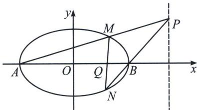

## 一、退化二次曲线对称轴不与坐标轴平行的曲线系

模型构造： $f_{1}(x,y)+\lambda f_{2}(x,y)=\mu f_{3}(x,y)$

根据上一节的内容，如果两条直线斜率互为相反数，则它们构造的退化二次曲线也是以坐标轴平行线为对称轴，这样与圆锥曲线构造的曲线系是指向圆。但当构成退化二次曲线的两相交直线斜率不为相反数时，那么它们可以形成圆以外的其它圆锥曲线，本讲介绍四点确定椭圆、双曲线和抛物线的曲线系方程。

## 高中数学 新思路 圆锥曲线专题

如图，A、B分别为椭圆 $\frac{x^{2}}{a^{2}}+\frac{y^{2}}{b^{2}}=1(a>b>0)$ 的左右顶点，M、N为椭圆上任意两点，MN与x轴交于点Q，AM与BN交于点P，我们可以理解为A，M，B，N四点确定椭圆（双曲线和抛物线也一致），那么四点之间连线有6条，我们选取一组过四点的直线乘积式构造退化二次曲线 $f_{1}(x,y)=0$ ，再选取另外两条过四点的直线乘积式构造另一退弱化的二次曲线 $f_{2}(x,y)=0$ ，可以理解为两条退化的二次曲线形成了这个椭圆 $f_{3}(x,y)=\frac{x^{2}}{a^{2}}+\frac{y^{2}}{b^{2}}-1=0$ ，即 $f_{1}(x,y)+\lambda f_{2}(x,y)=\mu f_{3}(x,y)$

注意 这里最终结果会指向一个极点极线性质 $x_{P}x_{Q}=a^{2}$ , 故在设计 $l_{AB}: y=0, l_{MN}: x-ty-m=0, f_{1}(x, y)=y \cdot (x-ty-m)=0, l_{AM}: x-t_{1}y+a=0, l_{BN}: x-t_{2}y-a=0$ $f_{2}(x, y)=(x-t_{1}y+a) \cdot (x-t_{2}y-a)=0$ , 从而得出: $y \cdot (x-ty-m)+\lambda(x-t_{1}y+a) \cdot (x-t_{2}y-a)=\mu\left(\frac{x^{2}}{a^{2}}+\frac{y^{2}}{b^{2}}-1\right)$ .

记住：曲线系只需要对比系数，确定参数，无需展开求出 $\lambda$ 和 $\mu, t, t_1, t_2$ 均是斜率倒数.
