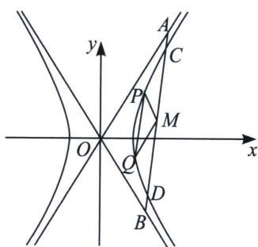

<!-- question-source:start -->
例12 (2022·新高考Ⅱ卷)设双曲线 C: $\frac{x^{2}}{a^{2}} - \frac{y^{2}}{b^{2}} = 1 (a > 0, b > 0)$ 右焦点为 F(2, 0)，渐近线方程为 $y = \pm \sqrt{3} x$ ,

(1)求 $C$ 的方程

(2)过 F 的直线与 C 的两条渐近线分别交于 A, B 两点，点 $P(x_{1}, y_{1})$ ， $Q(x_{2}, y_{2})$ 在 C 上，且 $x_{1} > x_{2} > 0$ ， $y_{1} > 0$ ，过 P 且斜率为 $-\sqrt{3}$ 的直线与过 Q 且斜率为 $\sqrt{3}$ 的直线交于点 M。请从下面①②③中选取两个作为条件，证明另一个条件成立：

①M 在 AB 上；②PQ//AB；③|MA|=|MB|.

(2)设 $A(x_{3},y_{3})$ ， $B(x_{4},y_{4})$ ，

方案一：用①③推导②.

$$
M \left(x _ {0}, y _ {0}\right)
$$

$$
- \sqrt {3}
$$

$$
\sqrt {3} x + y - (\sqrt {3} x _ {0} + y _ {0}) = 0
$$

$$
\sqrt {3} x - y - (\sqrt {3} x _ {0} - y _ {0}) = 0
$$

$$
x ^ {2} - \frac {y ^ {2}}{3} - 1 + \lambda (\sqrt {3} x + y - (\sqrt {3} x _ {0} + y _ {0})) (\sqrt {3} x - y - (\sqrt {3} x _ {0} - y _ {0})) = 0,
$$

显然有 $\lambda = -\frac{1}{3}$ ，从而 $PQ$ 的方程为： $-6xx_0 + 2yy_0 + 3x_0^2 - y_0^2 = 0$ ，故 $k_{PQ} \cdot k_{OM} = \frac{3x_0}{y_0} \cdot \frac{y_0}{x_0} = 3$ ，又因为 $|AM| = |BM|$ ，此时利用中点点差法 $\left\{ \begin{array}{l} x_3^2 - \frac{y_3^2}{3} = 0 \\ x_4^2 - \frac{y_4^2}{3} = 0 \end{array} \right.$ ，两式相减可得（详细过程请自行完成）： $k_{OM} k_{AB}$

## =3，由此知 $PQ \parallel AB$ .

方案二：用①②推导③.

$$
M \left(x _ {0}, y _ {0}\right)
$$

$$
- \sqrt {3}
$$

$$
\sqrt {3} x + y - (\sqrt {3} x _ {0} + y _ {0}) = 0
$$

$$
\sqrt {3} x - y - (\sqrt {3} x _ {0} - y _ {0}) = 0
$$

$$
x ^ {2} - \frac {y ^ {2}}{3} - 1 + \lambda [ \sqrt {3} x + y - (\sqrt {3} x _ {0} + y _ {0}) ] [ \sqrt {3} x - y - (\sqrt {3} x _ {0} - y _ {0}) ] = 0,
$$

显然有 $\lambda = -\frac{1}{3}$ ，从而 $PQ$ 的方程为： $-6xx_0 + 2yy_0 + 3x_0^2 - y_0^2 = -3$ ，故 $k_{PQ} \cdot k_{OM} = \frac{3x_0}{y_0} \cdot \frac{y_0}{x_0} = 3$

$$
P Q \parallel A B
$$

$$
k _ {A B} = \frac {3 x _ {0}}{y _ {0}}
$$

$$
\left\{ \begin{array}{l} 3 x ^ {2} - y ^ {2} = 0 \\ y = k x + m \end{array} (3 - k ^ {2}) x ^ {2} - 2 k m x - m ^ {2} = 0 \right.
$$

$$
x _ {3} + x _ {4} = \frac {2 k m}{3 - k ^ {2}}
$$

$$
k = \frac {3 x _ {0}}{y _ {0}}, m = - k x _ {0} + y _ {0} = \frac {- 3 x _ {0} ^ {2}}{y _ {0}} + y _ {0}
$$

$$
x _ {3} + x _ {4} = \frac {2 k m}{3 - k ^ {2}} = 2 x _ {0}
$$

设 $M(x_{0}, y_{0})$ ，因为 PM 的斜率为 $-\sqrt{3}$ ，从而有直线 PM 的方程为： $\sqrt{3}x + y - (\sqrt{3}x_{0} + y_{0}) = 0$ 同理直线 QM 的方程为： $\sqrt{3}x-y-(\sqrt{3}x_{0}-y_{0})=0$ ，故直线 PQ 的方程可以用下列曲线系来表示：

$$
x ^ {2} - \frac {y ^ {2}}{3} - 1 + \lambda [ \sqrt {3} x + y - (\sqrt {3} x _ {0} + y _ {0}) ] [ \sqrt {3} x - y - (\sqrt {3} x _ {0} - y _ {0}) ] = 0,
$$

显然有 $\lambda = -\frac{1}{3}$ ，从而 $PQ$ 的方程为： $-6xx_0 + 2yy_0 + 3x_0^2 - y_0^2 = -3$ ，故 $k_{PQ} \cdot k_{OM} = \frac{3x_0}{y_0} \cdot \frac{y_0}{x_0} = 3$ ，由于 $PQ // AB$ ，所以 $k_{AB} = \frac{3x_0}{y_0}$ ，此时利用中点点差法 $\left\{ \begin{array}{l} x_3^2 - \frac{y_3^2}{3} = 0 \\ x_4^2 - \frac{y_4^2}{3} = 0 \end{array} \right.$ ，两式相减可得： $\frac{y_3 - y_4}{x_3 - x_4} \cdot \frac{y_3 + y_4}{x_3 + x_4} = 3$ ，所以 $\frac{3x_0}{y_0} \cdot \frac{y_3 + y_4}{x_3 + x_4} = 3 \Rightarrow \frac{2x_0}{x_3 + x_4} \cdot \frac{y_3 + y_4}{2y_0} = 1$ ，又因为 $|AM| = |BM|$ ，故当且仅当 $\left\{ \begin{array}{l} x_3 + x_4 = 2x_0 \\ y_3 + y_4 = 2y_0 \end{array} \right.$ 时 $*$ 式恒成

立，所以 M 在 AB 上.
<!-- question-source:end -->
