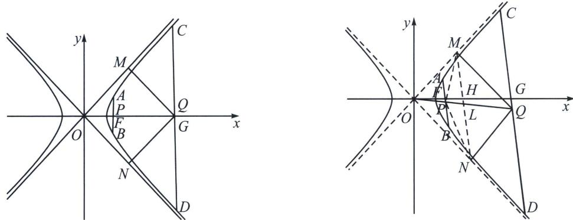

<!-- question-source:start -->
例14 (2025·福建教学联盟开学考第19题)在平面直角坐标系 $xOy$ 中, 点 $T$ 到点 $F(2, 0)$ 的距离与到直线 $x=1$ 的距离之比为 $\sqrt{2}$ , 记 $T$ 的轨迹为曲线 $E$ .

(1)求 E 的标准方程;

(2)若直线 $l_{1}$ 过点 $(2,0)$ 交 $E$ 右支于 $A, B$ 两点，直线 $l_{2}$ 过点 $(8,0)$ 且交 $E$ 的右支于 $C, D$ 两点，且 $l_{1} // l_{2}$ 记 $AB, CD$ 的中点分别为 $P, Q$ ，过点 $Q$ 作 $E$ 两条渐近线的垂线，垂足分别为 $M, N$ ;

(i)证明： $O 、 P 、 Q$ 三点共线；

(ii)求四边形 PMQN 面积的取值范围.

(1)设点 $T(x, y)$ , 因为点 $T$ 到点 $F(2, 0)$ 的距离与到直线 $x = 1$ 的距离之比为 $\sqrt{2}$ ,

所以 $\frac{\sqrt{(x - 2)^2 + y^2}}{|x - 1|} = \sqrt{2}$ ，整理得 $\frac{x^2}{2} -\frac{y^2}{2} = 1$ ，所以 $E$ 的标准方程为 $\frac{x^2}{2} -\frac{y^2}{2} = 1$ 。

(2)(i)根据题意: 若直线 $l_{1}$ 过点 $(2,0)$ 交 $E$ 右支于 $A$ , $B$ 两点, 直线 $l_{2}$ 过点 $(8,0)$ 且交 $E$ 的右支于 $C$ , $D$ 两点, 且 $l_{1} / / l_{2}$ 记 $A B$ , $C D$ 的中点分别为 $P$ , $Q$ , 过点 $Q$ 作 $E$ 两条渐近线的垂线, 垂足分别为 $M$ , $N$ ,

由题意可知直线 $l_{1}$ 和直线 $l_{2}$ 斜率若存在则均不为0且不为 $\pm 1$

①直线 $AB$ 的斜率不存在时, $P 、 Q$ 都在 $x$ 轴上, $O 、 P 、 Q$ 三点共线.

②直线 $AB$ 斜率存在时, 则可设方程为 $y = kx + b (k \neq 0, 1)$ , $A(x_{1}, y_{1})$ 、 $B(x_{2}, y_{2})$ , $P\left(\frac{x_{1} + x_{2}}{2}, \frac{y_{1} + y_{2}}{2}\right)$ .

接下来可以使用利用点差法求出 $k_{AB} \cdot k_{OP}$ ，由 $\left\{ \begin{array}{l} \frac{x_1^2}{2} - \frac{y_1^2}{2} = 1 \\ \frac{x_2^2}{2} - \frac{y_2^2}{2} = 1 \end{array} \right.$ ，得 $2(x_1 - x_2)(x_1 + x_2) = (y_1 - y_2)(y_1 + y_2)$ ，

所以 $\frac{(y_1 - y_2)}{(x_1 - x_2)}$ . $\frac{(y_1 + y_2)}{(x_1 + x_2)} = 1$ , $k_{AB} = \frac{y_1 - y_2}{x_1 - x_2}$ , $k_{OP} = \frac{y_1 + y_2}{x_1 + x_2}$ , 所以 $k_{AB} \cdot k_{OP} = 1$ , 同理 $k_{CD} \cdot k_{OQ} = 1$ , 因为 $l_1 // l_2$ , 所以 $k_{AB} = k_{CD}$ , 所以 $k_{OP} = k_{OQ}$ , 所以 $O, P, Q$ 三点共线. 综上, $O, P, Q$ 三点共线.

（ii）由题意可知直线 $l_{1}$ 和直线 $l_{2}$ 斜率若存在则斜率大于 $l$ 或小于-1，且曲线 $E$ 的渐近线方程为 $x \pm y = 0$

①当 $AB \parallel CD \parallel y$ 轴时， $Q$ 与 $G(8,0)$ 重合， $P$ 与 $F(2,0)$ 重合，如左图， $M(4,4), N(4,-4)$ ， $S_{PMQN} = \frac{1}{2} \times 8 \times 6 = 24$ ;

②当 $k_{AB} = k_{CD} = k$ 时，点差法可证出 $k_{OP} \cdot k_{AB} = 1, k_{OQ} \cdot k_{CD} = 1, x_M = \frac{x_C}{2}, x_N = \frac{x_D}{2}$ 利用中点性质可知 $\frac{x_M + x_N}{2} = x_L = \frac{x_C + x_D}{4} = \frac{x_Q}{2}, MN // AB // CD,$ 利用平行线性质， $\frac{OH}{OG} = \frac{OL}{OQ}$ ，所以 $MN$ 过定点 $H(4,0)$ ，设

MN: $x = ty + 4$ ，联立 $\left\{ \begin{array}{l} x = ty + 4 \\ x^2 - y^2 = 0 \end{array} \right.$ ， $y^2(t^2 - 1) + 8ty + 16 = 0$ ， $\left\{ \begin{array}{l} y_1 + y_2 = -\frac{8t}{t^2 - 1} \\ y_1y_2 = \frac{16}{t^2 - 1} \end{array} \right.$ ，交一支显然 $0 < t^2 < 1$ ， $S_{QMN} = S_{OMN} = \frac{1}{2}\sqrt{1 + t^2} |y_2 - y_1| \cdot \frac{4}{\sqrt{1 + t^2}} = 2 |y_2 - y_1|$ ， $S_{PMN} = S_{FMN} = \frac{1}{2}\sqrt{1 + t^2} |y_2 - y_1| \cdot \frac{2}{\sqrt{1 + t^2}} = |y_2 - y_1|$ ， $S_{PMQN} = S_{QMN} + S_{PMN} = 3 |y_1 - y_2| = \frac{24}{|t^2 - 1|} > 24$ ，所以 $S_{PMQN} \in [24, +\infty)$ ，所以四边形 PMQN 面积的取值范围为[24. +∞).
<!-- question-source:end -->

![[高中/总复习/专题/2026版高中《mst老唐说题》圆锥曲线专题（数学）/上册/第08章_联立计算高阶篇/第六节_二次曲线方程与四点联立曲线系/七_双曲线退化二次曲线系方程/例题/answers/Q00048739A1.md]]
