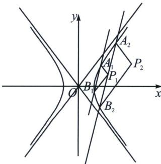

<!-- question-source:start -->
例13（2024·广州模拟第19题）已知双曲线 $C: \frac{x^2}{a^2} - \frac{y^2}{b^2} = 1 (a > 0, b > 0)$ 的两条渐近线分别为 $l_1: y = 2x$ 和 $l_2: y = -2x$ ，右焦点坐标为 $(\sqrt{5}, 0)$ ， $O$ 为坐标原点.

(1)求双曲线的标准方程;

(2) 直线 y=4x-6 与双曲线的右支交于点 $A_{1}$ ， $B_{1}(A_{1}$ 在 $B_{1}$ 的上方)，过点 $A_{1}$ ， $B_{1}$ 分别作 $l_{2}$ ， $l_{1}$ 的平行线，交于点 $P_{1}$ ，过点 $P_{1}$ 且斜率为 4 的直线与双曲线交于点 $A_{2}$ ， $B_{2}(A_{2}$ 在 $B_{2}$ 的上方），再过点 $A_{2}$ ， $B_{2}$ 分别作 $l_{2}$ ， $l_{1}$ 的平行线，交于点 $P_{2}$ ，…，这样一直操作下去，可以得到一列点 $P_{1}$ ， $P_{2}$ ，…， $P_{n}$ ， $n \geqslant 3$ ， $n \in N^{*}$ .

证明：① $P_{1}$ ， $P_{2}$ ，…， $P_{n}$ 共线；② $\left|OP_{i}\right|^{2}-\left|P_{i}P_{i+1}\right|^{2}$ 为定值， $1\leqslant i\leqslant n-1$ ， $i\in N^{*}$

<!-- question-source:end -->

![[高中/总复习/专题/2026版高中《mst老唐说题》圆锥曲线专题（数学）/上册/第08章_联立计算高阶篇/第六节_二次曲线方程与四点联立曲线系/七_双曲线退化二次曲线系方程/例题/answers/Q00053104A1.md]]
