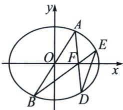

<!-- question-source:start -->
例5 (2023·江苏月考)在平面直角坐标系 $xOy$ 中, 椭圆 $C: \frac{x^2}{a^2} + \frac{y^2}{b^2} = 1 (a > b > 0)$ 的离心率是 $\frac{1}{2}$ , 焦点到相应准线的距离是 3.

(1) 求 $a, b$ 的值；

(2)已知 $A 、 B$ 是椭圆 $C$ 上关于原点对称的两点, $A$ 在 $x$ 轴的上方, $F(1,0)$ , 连接 $A F 、 B F$ 并分别延长交椭圆 $C$ 于 $D 、 E$ 两点, 证明: 直线 $D E$ 过定点.

(1)由题意可得 $\frac{c}{a} = \frac{1}{2}$ , $\frac{a^2}{c} - c = 3$ , 解得 $a = 2, c = 1$ , 所以 $b^2 = a^2 - c^2 = 4 - 1 = 3$ 故 $b = \sqrt{3}$ $AB: x - t_1y = 0$

(2)证明：令 $AD: x - t_{2}y - 1 = 0$ ，过二次曲线 $AB$ ， $DE$ 与二次曲线 $AD$ ， $BE$ 的四个交点 $A, B, D, E$ ， $DE: x - t_{3}y - 1 = 0$

的曲线系可表示为： $(x-t_{1}y)(x-t_{4}y-m)+\lambda(x-t_{2}y-1)(x-t_{3}y-1)=\mu\left(\frac{x^{2}}{4}+\frac{y^{2}}{3}-1\right)$ ，对比两边x项系数，得 $-m+\lambda(-2)=0$ ，对比两边 $x^{2}$ 项系数，得 $1+\lambda=\frac{\mu}{4}$ ，对比常数项，得 $\lambda=-\mu$ ，联立以上三式，解得 $\lambda=-\frac{4}{5}$ ， $m=\frac{8}{5}$ ，故直线DE恒过 $\left(\frac{8}{5},0\right)$ .

注意 一般曲线系的对比系数环节，选取 $xy$ 、 $x$ 、 $y$ 、 $x^{2}$ 、 $y^{2}$ 、常数项六个当中的两三个最好，尽量避开参数多的选项，比如本题当中含有 $t_{1}$ 、 $t_{2}$ 、 $t_{3}$ 、 $t_{4}$ 的 $y$ 或者 $y^{2}$ .
<!-- question-source:end -->

![[高中/总复习/专题/2026版高中《mst老唐说题》圆锥曲线专题（数学）/上册/第08章_联立计算高阶篇/第六节_二次曲线方程与四点联立曲线系/三_用曲线系速解坎迪定理/例题/answers/Q00048731A1.md]]
