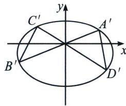

<!-- question-source:start -->
例7 已知椭圆 $\frac{x^{2}}{a^{2}}+\frac{y^{2}}{b^{2}}=1(a>b>0)$ 过点 $(2,\sqrt{2})$ ，离心率为 $\frac{\sqrt{2}}{2}$ .

(1)求椭圆的方程;

(2)过点 $P(0,1)$ 做椭圆的两条弦 $AB, CD(A,C$ 分别位于第一、二象限), 若 $BC, AD$ 与直线 $y=1$ 分

别交于 M, N, 求证: $\left|PM\right|=\left|PN\right|$ .

(1) $\frac{x^2}{8} + \frac{y^2}{4} = 1$

(2)将椭圆按(0, -1)平移得： $\frac{x^{2}}{8}+\frac{y^{2}}{4}+\frac{y}{2}-\frac{3}{4}=0$

$$
A ^ {\prime} B ^ {\prime}: y = k _ {1} x, C ^ {\prime} D ^ {\prime}: y = k _ {2} x, A ^ {\prime} D ^ {\prime}: x = t _ {1} y + m _ {1}, B ^ {\prime} C ^ {\prime}: x = t _ {2} y + m _ {2},
$$

所以 $(k_{1}x - y)(k_{2}x - y) + \lambda (x - t_{1}y - m_{1})(x - t_{2}y - m_{2}) = \mu \left(\frac{x^{2}}{8} +\frac{y^{2}}{4} +\frac{y}{2} -\frac{3}{4}\right)$

所以 $x$ 系数： $\lambda (-m_1 - m_2) = 0$ ，所以 $m_{1} + m_{2} = 0$
<!-- question-source:end -->

![[高中/总复习/专题/2026版高中《mst老唐说题》圆锥曲线专题（数学）/上册/第08章_联立计算高阶篇/第六节_二次曲线方程与四点联立曲线系/三_用曲线系速解坎迪定理/例题/answers/Q00048733A1.md]]
