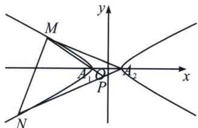

<!-- question-source:start -->
例1（2023·新高考Ⅱ）已知双曲线 C 中心为坐标原点，左焦点为 $(-2\sqrt{5}, 0)$ ，离心率为 $\sqrt{5}$ .

(1) 求 C 的方程;

(2)记 C 的左、右顶点分别为 $A_{1}$ ， $A_{2}$ ，过点 $(-4,0)$ 的直线与 C 的左支交于 M，N 两点，M 在第二象限，直线 $MA_{1}$ 与 $NA_{2}$ 交于 P，证明 P 在定直线上.

(1)双曲线 $C$ 中心为原点，左焦点为 $(-2\sqrt{5}, 0)$ ，离心率为 $\sqrt{5}$ ，则 $\left\{ \begin{array}{l} c^2 = a^2 + b^2 \\ c = 2\sqrt{5} \\ e = \frac{c}{a} = \sqrt{5} \end{array} \right.$ ，解得 $\left\{ \begin{array}{l} a = 2 \\ b = 4 \end{array} \right.$ ，

故双曲线 C 的方程为 $\frac{x^{2}}{4}-\frac{y^{2}}{16}=1$ ;

(2) $A_{1}M: x=t_{1}y-2, A_{2}N: x=t_{2}y+2$ ，联立可得： $x_{P}=\frac{2(t_{1}+t_{2})}{t_{1}-t_{2}}$ ;

$A_{1}A_{2}: y=0, MN: x=ty-4;$ 故曲线系方程为： $(x-t_{1}y+2)(x-t_{2}y-2)+\lambda y(x-ty+4)=\mu\left(\frac{x^{2}}{4}-\frac{y^{2}}{16}-1\right)$

对比 $xy$ 系数： $-t_1 - t_2 + \lambda = 0$ ，对比 $y$ 系数： $2t_{1} - 2t_{2} + 4\lambda = 0$ ， $x_{P} = \frac{2(t_{1} + t_{2})}{t_{1} - t_{2}} = \frac{2\lambda}{-2\lambda} = -1.$
<!-- question-source:end -->

![[高中/总复习/专题/2026版高中《mst老唐说题》圆锥曲线专题（数学）/上册/第08章_联立计算高阶篇/第六节_二次曲线方程与四点联立曲线系/二_用曲线系方程破解高考极点极线题型/例题/answers/Q00048727A1.md]]
