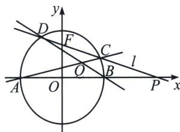

<!-- question-source:start -->
例3 (2011·四川)如图, 椭圆有两顶点 $A(-1, 0)$ 、 $B(1, 0)$ , 过其焦点 $F(0, 1)$ 的直线 $l$ 与椭圆交于 $C$ , $D$ 两点, 并与 $x$ 轴交于点 $P$ . 直线 $AC$ 与直线 $BD$ 交于点 $Q$ . 当点 $P$ 异于 $A$ , $B$ 两点时, 求证: $\overrightarrow{OP} \cdot \overrightarrow{OQ}$ 为定值.

<!-- question-source:end -->

![[高中/总复习/专题/2026版高中《mst老唐说题》圆锥曲线专题（数学）/上册/第08章_联立计算高阶篇/第六节_二次曲线方程与四点联立曲线系/二_用曲线系方程破解高考极点极线题型/例题/answers/Q00048729A1.md]]
